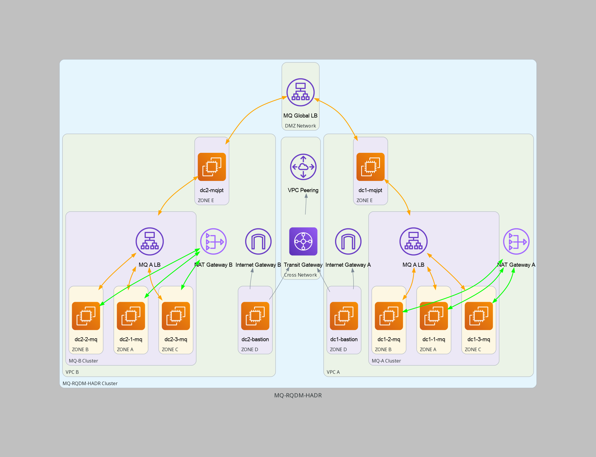

# Build Files for the AWS MQ-RDQM-HA Project
- built using make and bash scripts. No terraform, ansible or python dependencies


## 

## Init the project
- this makes a user data directory per PRJ_ID
- PRJ_ID is the project name + the revision number 
- generates the etc/hosts additions for the bastion servers
```
make init
```

# AWS Infrastructure

## Make the Transit Gateways
- this creates the transit gateways for each region, this is how the two regions will communicate between VPCs
```
make transit-gateway-a
make transit-gateway-b
```

## Make the VPC's
```
make vpc-a
make vpc-b
```

## Make the Subnets for the VPC's
```
make subnets-a
make subnets-b
```

## Attach the VPC's to the regional TransitGateway
```
make attach-vpc-2-gw-a
make attach-vpc-2-gw-b
```

## Connect the 2 TransitGateways
```
make peering

# wait a minute.. 
make accept-peering

# watch this until an ID comes up
make wait-for-peering

make peering-routes

```

## Make an internet gateway
```
make internet-gateway-a
make internet-gateway-b
```

# attach the internet gatewy to the vpc
```
make attach-vpc-to-igw-a
make attach-vpc-to-igw-b
```

## Create a route table for the internet gateway
```
make igw-route-table-a
make igw-route-table-b
```

## Create a route for the internet gateway
this adds the internet gateway route to the route table of the VPC
```
make igw-route-a
make igw-route-b
make igw-a-rt-attach-bastion-subnet
make igw-b-rt-attach-bastion-subnet
```

## Create a nat gateway for internet access to the private subnet and link to the vpc
- NOTE here that IP allocation can fail if you are out of spots. 5 Per region MAX

```
make nat-gw-a-ip
make nat-gw-b-ip
make nat-gw-a
make nat-gw-b
make associate-subnet-with-nat-gw-a
make associate-subnet-with-nat-gw-b

```

## Create regional routes
``` 
make region-b-a-route
make region-a-b-route
make bastion-a-b-route
make bastion-b-a-route

```

## Setup secirity groups 
- we will add all rules to the default autocreated security group for each VPC
```
make add-region-a-traffic-to-b
make add-region-b-traffic-to-a
```

## create your bastion ssh key and store it in both regions
```
make generate-key-pair
make generate-public-key
make import-key-pair-region-b
```

## Create the bastion Server
- this creates the bastion server and places it on the correct subnet with the correct ip
```
make bastion-a
make bastion-b
```


# Add ssh access to the bastion server
- this adds the firewall policy for ssh to the bastion host
```
make add-ssh-access-to-bastion-a
make add-ssh-access-to-bastion-b
```

# add bastion keypair
- the key-pair made to connect from your machine to the bastion, will be added to the bastion so that it can in turn connect to other EC2 instances
```bash
make ec2-setup-bastion-keypair
```

## Make EC2 Hosts
```bash
make ec2-a-a
make ec2-a-b
make ec2-a-c
make ec2-b-a
make ec2-b-b
make ec2-b-c
make ec2-a-mqipt
make ec2-b-mqipt
```
## Wait for about 2-3 minutes for all 6 instances to come up

## UPDATE EC2 HOSTS
```bash
# OS SETUP
make ec2-bastion-setup
make mqm-keypair
make ec2-bastion-accept-fingerprints
make ec2-create-configs
make ec2-copy-files-bastion
make all-ec2-copy-files
make all-ec2-dnf

# USER SETUP
make all-ec2-add-user
make all-ec2-setup-mqm-user
make ec2-setup-mqm-bastion
make ec2-bastion-accept-mqm-fingerprints
make ec2-setup-mqm-master
make ec2-master-nodes-accept-fingerprints


# HOST SETUP
make all-ec2-update-sudoers
make all-ec2-volumes
make all-ec2-hostname
make ec2-mqipt-hostname
make all-ec2-system-settings
make ec2-etc-hosts

# WAIT A BIT, the last command issued a reboot

# SOFTWARE SETUP
make all-ec2-mqadv
make ec2-activate-node
make all-ec2-kmod-drbd
# make all-ec2-firewall
make all-ec2-rqdm
make ec2-mq-config
make ec2-rdqmadm
###
# If for any reason you've broken the db init
# run -> sudo /opt/mqm/bin/rdqmadm -u
###
make ec2-rdqmadm-status
make ec2-dr-queue
make ec2-dr-fail-b
make ec2-dr-queue
make ec2-dr-fail-a
make ec2-dr-queue


```


## Tools
A docker image with the prebuilt tools is located in the container directory
- when built it is about 750 mb

```bash
# TO BUILD
docker build -t rqdm-tools
# TO RUN
docker run -it rqdm-tools
```
