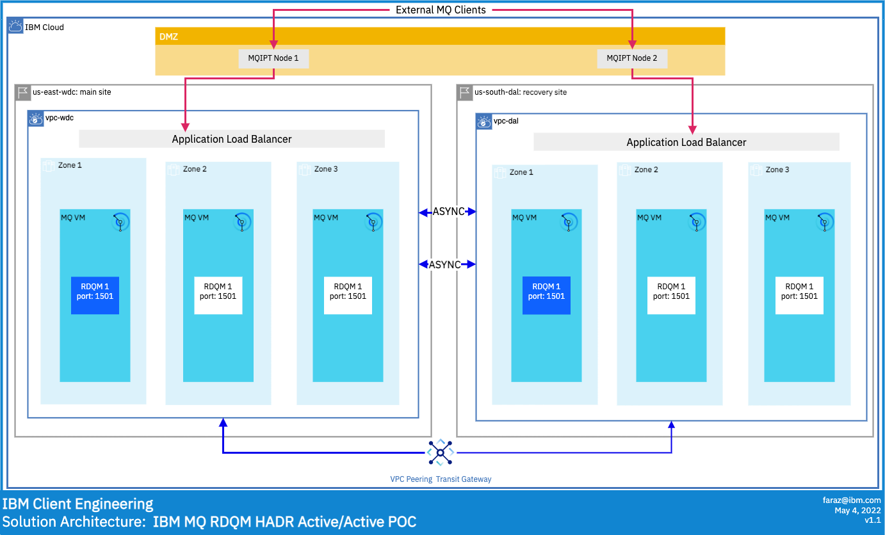

# Solution Document
### IBM MQ RDQM HADR w/ MQIPT


- [Solution Document](#solution-document)
		- [IBM MQ RDQM HADR w/ MQIPT](#ibm-mq-rdqm-hadr-w-mqipt)
- [Introduction and Intent](#introduction-and-intent)
	- [Background and Intent](#background-and-intent)
- [Solution Strategy](#solution-strategy)
	- [Overview](#overview)
	- [Building Block View](#building-block-view)
	- [Deployment](#deployment)
	- [Manual Deployment](#manual-deployment)
		- [Installing and Configuring IBM MQ and RDQM](#installing-and-configuring-ibm-mq-and-rdqm)
		- [Installation of MQ](#installation-of-mq)
			- [Host layout](#host-layout)
			- [System preparation](#system-preparation)
			- [Installing MQ](#installing-mq)
		- [Installing RDQM](#installing-rdqm)
		- [Creating A Disaster Recovery Queue](#creating-a-disaster-recovery-queue)
			- [Creating DRHAQM1 With Primary in DC](#creating-drhaqm1-with-primary-in-dc)
		- [Installing MQIPT](#installing-mqipt)
			- [Enable MQIPT as a system service](#enable-mqipt-as-a-system-service)
			- [Templating the service file for multiple MQIPT instances](#templating-the-service-file-for-multiple-mqipt-instances)
	- [Security](#security)
		- [SSL configuration for MQ and MQ-IPT](#ssl-configuration-for-mq-and-mq-ipt)
			- [Creating the new queue manager](#creating-the-new-queue-manager)
			- [Configuring OpenLDAP in a container](#configuring-openldap-in-a-container)
			- [Configuring SSL in Queue Manager and client](#configuring-ssl-in-queue-manager-and-client)
			- [Setting the channel auth for SSL](#setting-the-channel-auth-for-ssl)
		- [Configuring MQ-IPT for SSLServer/Client](#configuring-mq-ipt-for-sslserverclient)
		- [MQ to MQ and SSL encryption](#mq-to-mq-and-ssl-encryption)
		- [Connecting two queue managers via SSL/TLS and self-signed certs](#connecting-two-queue-managers-via-ssltls-and-self-signed-certs)
		- [Denying connections based on SSLPEER](#denying-connections-based-on-sslpeer)
	- [Testing](#testing)
		- [Testing Tools](#testing-tools)
	- [Failover testing for MQ HADR and RDQM](#failover-testing-for-mq-hadr-and-rdqm)
		- [Setup](#setup)
		- [Testing with persistent messages with syncpoint](#testing-with-persistent-messages-with-syncpoint)
		- [Regional failover testing](#regional-failover-testing)
# Introduction and Intent
## Background and Intent
This Solution Document covers the following
- Validate MQIPT architecture for Guaranteed message delivery using IBM MQ
- Validate the function of MQIPT as a secure MQ proxy inn the DMZ
- High Availability and Disaster Recovery across multiples zones and regions using RDQM
- IBM MQ and MQIPT security constructs (LDAP authentication, MQIPT mTLS, SSL Peering, Channel security)

# Solution Strategy

## Overview

This solution architecture demonstrates how you can deploy the Replicated Data Queue Manager in a Highly Available, Disaster Recovery enabled configuration across two regions that are interconnected/peered by a construct like the Transit Gateway (MZRs in IBM Cloud or Regions in AWS).

- MQIPT nodes are setup in a DMZ subnet that is able to accept traffic from the internet on port `1501` and `1502`. The IPT nodes proxy the traffic to an Application Load Balancer that in turn will direct the traffic to the active RDQM instance in one of the three active zones.


## Building Block View


## Deployment

## Manual Deployment
### Installing and Configuring IBM MQ and RDQM

This document serves as a documented process for installing IBM MQ and RDMQ bound to the # Solution Strategy. It assumes some basic familiarlity with Linux command line.

### Installation of MQ

In order to build out our setup, we are assuming three hosts that live in three different zones in a Dallas region and three hosts in three zones living in the Washington DC region . Our bastion host will also live in WDC and that's where we'll base our primary HA stack. We also assume root access via ssh to all hosts here. The OS on the mq hosts for our purposes will be **Red Hat 8.4**. We will also assume they are properly subscribed.

```
10.241.1.4      wdc-bastion

# WDC mq hosts
10.241.0.4	        wdc1-mq1
10.241.64.4    	    wdc2-mq1
10.241.128.4	    wdc3-mq1

# DAL mq hosts
10.240.0.4	        dal1-mq1
10.240.64.4	        dal2-mq1
10.240.128.4	    dal3-mq1
```

Above is what the hosts file on our bastion host should look like. We would connect to the bastion host via a public ip. We won't go into configuring ssh `proxyjump` in this section.

#### Host layout

Each of the above hosts barring the bastion have two extra disks attached:

```
Disk /dev/vda: 100 GiB, 107374182400 bytes, 209715200 sectors
Disk /dev/vdb: 100 GiB, 107374182400 bytes, 209715200 sectors
Disk /dev/vde: 25 GiB, 26843545600 bytes, 52428800 sectors
```

- `/dev/vda` is our boot volume
- `/dev/vdb` will become our logical volume for `/var/mqm`
- `/dev/vde` will be our RDQM managed volume

IBM MQ installation recommends multiple separate disks for various aspects of MQ to increase performance and minimize overall I/O during heavy operations. For our purposes, we will only be going with one volume for MQ.

#### System preparation

1. Create the mqm userid and group. This step occurs on all host minus the bastion host.

```
groupadd -g 1001 mqm
useradd -g mqm -u 1001 -m -c "MQM User" mqm
```
2. Update mqm user's bashrc and bash profile. These paths don't exist as of yet until the actual installation of MQ.
```
echo "export MQ_INSTALLATION_PATH=/opt/mqm" >> ~mqm/.bashrc
echo '. $MQ_INSTALLATION_PATH/bin/setmqenv -s' >> ~mqm/.bashrc
echo 'export PATH=$PATH:/opt/mqm/bin:/opt/mqm/samp/bin:' >> ~mqm/.bash_profile
```

3. Update `/etc/sudoers` with the correct permissions for mqm user
```
echo "%mqm ALL=(ALL) NOPASSWD: /opt/mqm/bin/crtmqm,/opt/mqm/bin/dltmqm,/opt/mqm/bin/rdqmadm,/opt/mqm/bin/rdqmstatus" >> /etc/sudoers
```
4. **OPTIONAL** - for ease of use and communication, you can create an ssh key for the `mqm` user and propagate it across the nodes in each stack. This isn't required, but it can mean you might only need to run some commands on the primary node in each stack and it will run the appropriate commands on each node behind the scenes.

    On Node 1:
```
as mqm user
[mqm@wdc1-mq1 ~]$ ssh-keygen -t rsa -f /home/mqm/.ssh/id_rsa -N ''
[mqm@dal1-mq1 ~]$ ssh-keygen -t rsa -f /home/mqm/.ssh/id_rsa -N ''
```

Manually copy the public key to the `authorized_keys` file in `~/.ssh` for `mqm` user on each node in each stack.

5. Install lvm2 if it's not already there
```
dnf -y install lvm2
```
6. Setup the volume group and logical volume for `/var/mqm`
```
pvcreate /dev/vdb
vgcreate MQStorageVG /dev/vdb
lvcreate -n MQStorageLV -l100%VG MQStorageVG
```
7. Create the `/var/mqm` directory and format the storage volume
```
mkdir /var/mqm
mkfs.xfs /dev/MQStorageVG/MQStorageLV
mount /dev/MQStorageVG/MQStorageLV /var/mqm
```
8. Make sure `/var/mqm` is fully owned by the mqm user and that everything is setup in `/etc/fstab`
```
chown -R mqm:mqm /var/mqm
chmod 755 /var/mqm
echo "/dev/MQStorageVG/MQStorageLV      /var/mqm        xfs     defaults        1 2" >> /etc/fstab
```
9. Configure the storage volume for RDQM. **It's critical that the volume group is named `drbdpool`.**
```
parted -s -a optimal /dev/vde mklabel gpt 'mkpart primary ext4 1 -1'
pvcreate /dev/vde1
vgcreate drbdpool /dev/vde1
```
10. Add the following settings to `/etc/sysctl.conf`
```
kernel.shmmni = 4096
kernel.shmall = 2097152
kernel.shmmax = 268435456
kernel.sem = 32 4096 32 128
fs.file-max = 524288

sysctl -p
```
11. Set the ulimit for the mqm user by adding the following to `/etc/security/limits.conf`
```
# For MQM User
mqm       hard  nofile     10240
mqm       soft  nofile     10240
```

#### Installing MQ

This requires you to go to the following link and retrieving IBM MQ Advanced developer version 9.2.5:

[**mqadv_dev925_linux_x86-64.tar.gz**](https://www14.software.ibm.com/cgi-bin/weblap/lap.pl?popup=Y&li_formnum=L-APIG-BYHCL7&accepted_url=https://public.dhe.ibm.com/ibmdl/export/pub/software/websphere/messaging/mqadv/mqadv_dev925_linux_x86-64.tar.gz)

Once you have the package,  you will need to upload it to all six hosts. This document will assume you have done this. The following steps need to be taken on each host.

1. Extract the package on each host
```
tar zxvf mqadv_dev925_linux_x86-64.tar.gz
cd MQServer
```
2. Run the mqlicense script to accept the IBM license
```
./mqlicense.sh -accept
```
3. Install the packages for MQ on each host
```
dnf -y install MQSeries*.rpm --nogpgcheck
```
4. Run the following command **ONLY** on the primary node in each stack. For example, for our WDC stack we would run this on `wdc1-mq1` and for our Dallas stack we would run this only on `dal1-mq1`
```
[root@dal1-mq1 ~]# /opt/mqm/bin/setmqinst -i -p /opt/mqm
[root@wdc1-mq1 ~]# /opt/mqm/bin/setmqinst -i -p /opt/mqm
```

### Installing RDQM

One of the primary components for RDQM is DRBD. IBM packages its own kmod-drbd packages with the MQ tar file. This is why knowing what kernel version you are running is critical. For this, IBM included a script called `modver`. The following commands need to be performed on every host in each region.

1. On each host, run the `modver` script to determine which kmod to install
```
cd ~/MQServer/Advanced/RDQM/PreReqs/el8/kmod-drbd-9
./modver
kmod-drbd-9.1.5_4.18.0_305-1.x86_64.rpm
```
This should show you which of the kernel packages in that directory that you need to install. If it returns any sort of error, you need to follow the link it provides and download the appropriate kmod-drbd version.

2. Install the kmod-drbd version
```
cd ~/MQServer/Advanced/RDQM/PreReqs/el8/kmod-drbd-9
dnf -y install $(./modver) --nogpgcheck
```
3. Install pacemaker and drbd-utils
```
cd MQServer/Advanced/RDQM/PreReqs/el8/pacemaker-2
dnf -y install *.rpm --nogpgcheck

cd MQServer/Advanced/RDQM/PreReqs/el8/drbd-utils-9/
dnf -y install *.rpm --nogpgcheck
```
4. Install policycoretutils-python-utils to set the correct security context for DRBD
```
dnf -y install policycoreutils-python-utils
semanage permissive -a drbd_t
```
5. Configure `firewalld` on each host. We're going to add a range of ports for async communication between stacks as well as between nodes. We'll also add our listener ports for the queue listener services.
```
firewall-cmd --add-port=6996-7800/tcp --permanent
firewall-cmd --add-port=1414-1514/tcp --permanent
firewall-cmd --reload
```
6. Finally, install the RDQM package itself
```
dnf -y install ~/MQServer/Advanced/RDQM/MQSeriesRDQM-9.2.5-0.x86_64.rpm --nogpgcheck
```
7. Edit `/var/mqm/rdqm.ini` and add in the hosts for that stack. This will be different per region but the `Name` field needs to be added to the default file and it **must** match the hostname of each node:

`/var/mqm/rdqm.ini` in WDC

```
Node:
  Name=wdc1-mq1
  HA_Replication=10.241.0.4
#  HA_Primary=
#  HA_Alternate=
#  DR_Replication=
Node:
  Name=wdc2-mq1
  HA_Replication=10.241.64.4
#  HA_Primary=
#  HA_Alternate=
#  DR_Replication=
Node:
  Name=wdc3-mq1
  HA_Replication=10.241.128.4
#  HA_Primary=
#  HA_Alternate=
#  DR_Replication=

#DRGroup:
#  Name=
#  DR_Replication=
#  DR_Replication=
#  DR_Replication=
```
`/var/mqm/rdqm.ini` in DAL
```
Node:
  Name=dal1-mq1
  HA_Replication=10.240.0.4
#  HA_Primary=
#  HA_Alternate=
#  DR_Replication=
Node:
  Name=dal2-mq1
  HA_Replication=10.240.64.4
#  HA_Primary=
#  HA_Alternate=
#  DR_Replication=
Node:
  Name=dal3-mq1
  HA_Replication=10.240.128.4
#  HA_Primary=
#  HA_Alternate=
#  DR_Replication=

#DRGroup:
#  Name=
#  DR_Replication=
#  DR_Replication=
#  DR_Replication=

```

8. Run the following on the primary node in each region:

```
/opt/mqm/bin/rdqmadm -c
```
If the ssh key was configured as mentioned above, the mqm user should be able to run this command on each node in the background. Otherwise the STDOUT returned will tell you wnat nodes still need to have it run.

9. Verify we're all online with:
```
rdqmstatus -n
```

### Creating A Disaster Recovery Queue

Now we are at the meat and potatoes. We're going to cover the steps to create a DR queue that is async replicated between regions. Let's get started.

Order is everything when it comes to creating a DR queue. The creation command is always run on the last node first and first node last.

#### Creating DRHAQM1 With Primary in DC

```
WDC region
[mqm@wdc3-mq1 ~]$ sudo /opt/mqm/bin/crtmqm -sxs -rr p -rl 10.241.0.4,10.241.64.4,10.241.128.4 -ri 10.240.0.4,10.240.64.4,10.240.128.4 -rp 7001 -fs 3072M DRHAQM1
[mqm@wdc2-mq1 ~]$ sudo /opt/mqm/bin/crtmqm -sxs -rr p -rl 10.241.0.4,10.241.64.4,10.241.128.4 -ri 10.240.0.4,10.240.64.4,10.240.128.4 -rp 7001 -fs 3072M DRHAQM1
[mqm@wdc1-mq1 ~]$ sudo /opt/mqm/bin/crtmqm -sx -rr p -p 1501 -rl 10.241.0.4,10.241.64.4,10.241.128.4 -ri 10.240.0.4,10.240.64.4,10.240.128.4 -rp 7001 -fs 3072M DRHAQM1 # Primary node in the stack

DAL region
[mqm@dal3-mq1 ~]$ sudo /opt/mqm/bin/crtmqm -sxs -rr s -ri 10.241.0.4,10.241.64.4,10.241.128.4 -rl 10.240.0.4,10.240.64.4,10.240.128.4 -rp 7001 -fs 3072M DRHAQM1
[mqm@dal2-mq1 ~]$ sudo /opt/mqm/bin/crtmqm -sxs -rr s -ri 10.241.0.4,10.241.64.4,10.241.128.4 -rl 10.240.0.4,10.240.64.4,10.240.128.4 -rp 7001 -fs 3072M DRHAQM1
[mqm@dal1-mq1 ~]$ sudo /opt/mqm/bin/crtmqm -sx -rr s -ri 10.241.0.4,10.241.64.4,10.241.128.4 -rl 10.240.0.4,10.240.64.4,10.240.128.4 -rp 7001 -fs 3072M DRHAQM1 # Primary node in the stack
```

Let's break down these commands:

**`crtmqm`** - command to actually create the queues

- **`-sxs`** - Replicated data HA secondary queue manager. This is run only on secondary or standby nodes when creating the queue.
- **`-sx`** - Replicated data HA Primary queue manager. This is run only on a primary node where you want the queue to live.
- **`-rr [p,s]`** - This is region specific. When you create your DR Queue, you would use "p" for the region you want to be DR Primary and "s" for the region you want to be standby. If you accidentally use "p" for both regions, your clusters will not talk to each other.
- **`-rl`**  `10.241.0.4,10.241.64.4,10.241.128.4` - Specifies the local ip address(es) to be used for DR replication of this queue manager. Basically your local region nodes go here.
- **`-ri`**  `10.240.0.4,10.240.64.4,10.240.128.4` - Specifies the IP address of the interface used for replication on the server hosting the secondary instance of the queue manager. Basically your remote region's nodes.
- **`-rp 7001`** - Specifies the port to use for DR replication. We're using port 7001 in this example.
- **`-fs 3072M`** - Specifies the size of the filesystem to create for the queue manager - that is, the size of the logical volume which is created in the drbdpool volume group. Another logical volume of that size is also created, to support the reverting to snapshot operation, so the total storage for the DR RDQM is just over twice that specified here.

If everything was done correctly, you should be able to log into your primary node in your primary region and run the following commands:

```
[mqm@wdc1-mq1 ~]$ sudo rdqmstatus -m DRHAQM1
Node:                                   wdc1-mq1
Queue manager status:                   Running
CPU:                                    0.00%
Memory:                                 182MB
Queue manager file system:              58MB used, 2.9GB allocated [2%]
HA role:                                Primary
HA status:                              Normal
HA control:                             Enabled
HA current location:                    This node
HA preferred location:                  This node
HA blocked location:                    None
HA floating IP interface:               None
HA floating IP address:                 None
DR role:                                Primary
DR status:                              Normal
DR port:                                7001
DR local IP address:                    10.241.0.4
DR remote IP address list:              10.240.0.4,10.240.64.4,10.240.128.4
DR current remote IP address:           10.240.0.4

Node:                                   wdc2-mq1
HA status:                              Normal

Node:                                   wdc3-mq1
HA status:                              Normal

[mqm@dal1-mq1 ~]$ sudo rdqmstatus -m DRHAQM1
Node:                                   dal1-mq1
Queue manager status:                   Ended immediately
HA role:                                Primary
HA status:                              Normal
HA control:                             Enabled
HA current location:                    This node
HA preferred location:                  This node
HA blocked location:                    None
HA floating IP interface:               None
HA floating IP address:                 None
DR role:                                Secondary
DR status:                              Normal
DR port:                                7001
DR local IP address:                    10.240.0.4
DR remote IP address list:              10.241.0.4,10.241.64.4,10.241.128.4
DR current remote IP address:           10.241.0.4

Node:                                   dal2-mq1
HA status:                              Normal

Node:                                   dal3-mq1
HA status:                              Normal
```

This queue service listener should be active on port 1501 on the primary node in the primary region only.

You can test failover with the following commands:

```
This tells the first node in the WDC region to become DR standby for the DRHAQM1 queue service
[root@wdc1-mq1 ~]# rdqmdr -s -m DRHAQM1


This tells the first node in the DAL region to become DR primary for the DRHAQM1 queue service
[root@dal1-mq1 ~]# rdqmdr -p -m DRHAQM1
```

So now the output of `rdqmstatus` will be:
```
[root@dal1-mq1 ~]# sudo rdqmstatus -m DRHAQM1
Node:                                   dal1-mq1
Queue manager status:                   Running
CPU:                                    1.09%
Memory:                                 182MB
Queue manager file system:              58MB used, 2.9GB allocated [2%]
HA role:                                Primary
HA status:                              Normal
HA control:                             Enabled
HA current location:                    This node
HA preferred location:                  This node
HA blocked location:                    None
HA floating IP interface:               None
HA floating IP address:                 None
DR role:                                Primary
DR status:                              Normal
DR port:                                7001
DR local IP address:                    10.240.0.4
DR remote IP address list:              10.241.0.4,10.241.64.4,10.241.128.4
DR current remote IP address:           10.241.0.4

Node:                                   dal2-mq1
HA status:                              Normal

Node:                                   dal3-mq1
HA status:                              Normal

[root@wdc1-mq1 ~]# sudo rdqmstatus -m DRHAQM1
Node:                                   wdc1-mq1
Queue manager status:                   Ended immediately
HA role:                                Primary
HA status:                              Normal
HA control:                             Enabled
HA current location:                    This node
HA preferred location:                  This node
HA blocked location:                    None
HA floating IP interface:               None
HA floating IP address:                 None
DR role:                                Secondary
DR status:                              Normal
DR port:                                7001
DR local IP address:                    10.241.0.4
DR remote IP address list:              10.240.0.4,10.240.64.4,10.240.128.4
DR current remote IP address:           10.240.0.4

Node:                                   wdc2-mq1
HA status:                              Normal

Node:                                   wdc3-mq1
HA status:                              Normal

```
You can fail everything back with the following commands

```
[root@dal1-mq1 ~]# rdqmdr -s -m DRHAQM1

[root@wdc1-mq1 ~]# rdqmdr -p -m DRHAQM1

```

The queue service should be accessible via port `1501` on the primary node in the primary region.

### Installing MQIPT

- SSH into your MQIPT server(s).
- Download and stage the MQIPT Software from [IBM Fix Central](https://www.ibm.com/support/fixcentral/swg/selectFixes?parent=ibm%7EWebSphere&product=ibm/WebSphere/WebSphere+MQ&release=9.2.0.0&platform=All&function=all)

In our instance we are downloading version `9.2.5.0-IBM-MQIPT-LinuxX64`

```
wget https://ak-delivery04-mul.dhe.ibm.com/sdfdl/v2/sar/CM/WS/0abcp/0/Xa.2/Xb.jusyLTSp44S0Bn8mossn7uopQHHST9iA1hmsJz52XllxgZWtruzIzbUG_ZE/Xc.CM/WS/0abcp/0/9.2.5.0-IBM-MQIPT-LinuxX64.tar.gz/Xd./Xf.LPR.D1VK/Xg.11755825/Xi.habanero/XY.habanero/XZ.1osh26bJ4dLZBVRjImrn31hkVvRbtvt0/9.2.5.0-IBM-MQIPT-LinuxX64.tar.gz
```

Please note that the `wget` command will not work - we are simply copying the direct link to the download from Fix Central and using `wget` to stage the software directly on the MQIPT servers.

- Create a directory to unpack the MQ IPT Software

```
mkdir -p /opt/mqipt/installation1
```

- Unpack the MQIPT software and modify permissions

```
cd /opt/mqipt/installation1/
tar zxvf ~/9.2.5.0-IBM-MQIPT-LinuxX64.tar.gz
chmod -R a-w /opt/mqipt/installation1/mqipt
```

- Append the following to your `~/.bashrc` file for your MQIPT user

```
MQIPT_PATH=/opt/mqipt/installation1/mqipt
export MQIPT_PATH
export PATH=$PATH:$MQIPT_PATH/bin
```
- You can now `source` your .bashrc by issuing the following command

```
. ~/.bashrc
```

- Create MQIPT configuration file

```
mkdir /opt/mqipt/installation1/mqipt/configs
cp /opt/mqipt/installation1/mqipt/samples/mqiptSample.conf /opt/mqipt/installation1/mqipt/configs/mqipt.conf
```

In this instance we are copying the sample configuration file to our MQIPT installation destination.

- Modify the `mqipt.conf` file

```
[route]
Name=DRHAQM1
Active=true
ListenerPort=1501
Destination=<hostname of your load balancer>
DestinationPort=1501

[route]
Name=DRHAQM2
Active=true
ListenerPort=1502
Destination=<hostname of your load balancer>
DestinationPort=1502
```
In this implementation we are creating two `[route]` entries for the two different regions that correspond to our 2 queues. Recall that we had previously created `DRHAQM1` and `DRHAQM2` to be listening on ports `1501` and `1502` respectively. Our loadbalanacer was also configured to forward traffic to these ports.


- Start MQIPT

```
mqipt /opt/mqipt/installation1/mqipt -n HAMQ
```

You should see the following output

```
5724-H72 (C) Copyright IBM Corp. 2000, 2022 All Rights Reserved
MQCPI001 IBM MQ Internet Pass-Thru 9.2.5.0 starting
MQCPI004 Reading configuration information from mqipt.conf
MQCPI152 MQIPT name is DRHAMQ
MQCPI022 Password checking has been disabled on the command port
MQCPI144 MQ Advanced capabilities not enabled
MQCPI011 The path /opt/mqipt/installation1/mqipt/configs/logs will be used to store the log files
MQCPI006 Route 1502 is starting and will forward messages to :
MQCPI034 .... ourlb.appdomain.cloud(1502)
MQCPI035 ....using MQ protocol
MQCPI078 Route 1502 ready for connection requests
MQCPI006 Route 1501 is starting and will forward messages to :
MQCPI034 ....ourlb.appdomain.cloud(1501)
MQCPI035 ....using MQ protocol
MQCPI078 Route 1501 ready for connection requests
```
Note that this initial implementation of MQIPT does not account for any mTLS or handshaking. In this mode, it is simply proxying traffic to the MQ servers (through our loadbalancers).

#### Enable MQIPT as a system service

*This assumes you are running on Red Hat >= 7.x, CentOS >= 7.x, or Ubuntu >= 16.x*

Create a new systemd service file called `/etc/systemd/system/mqipt.service`
```
[Unit]
Description=MQIPT Service for IBM MQ
Wants=network-online.target
After=network-online.target

[Service]
Type=exec
ExecStart=/bin/bash -c "/opt/mqipt/installation1/mqipt/bin/mqipt /opt/mqipt/installation1/mqipt/configs -n HAMQ"
ExecStop=/bin/bash -c "/opt/mqipt/installation1/mqipt/bin/mqiptAdmin -stop -n HAMQ"

[Install]
WantedBy=multi-user.target
```
In the file we created above, we've named our MQIPT instance as **HAMQ**. Logs can be viewed using the `systemctl` command or the `journalctl` command.

Refresh systemd with `systemctl daemon-reload`

Now MQIPT can be enabled to start on boot

```
systemctl enable mqipt
```
This will install the service file for mqipt to `/etc/init.d` which can be controlled using the `systemctl` command.
```
systemctl start mqipt
```
Make sure to enable this at boot time
```
systemctl enable mqipt
```
#### Templating the service file for multiple MQIPT instances

MQIPT has the ability to run with multiple instances and to control that with systemd we can simply create a config directory for each instance we want to control and run each with separate systemd templates. For example, we want to create an instance of MQIPT and name it `HAMQ`:

```
mkdir /opt/mqipt/installation1/mqipt/HAMQ
```
Move our existing `mqipt.conf` to that directory
```
mv /opt/mqipt/installation1/mqipt/configs/mqipt.conf /opt/mqipt/installation1/mqipt/HAMQ
```
Create a systemd service template as `/etc/systemd/system/mqipt-@.service`
```
touch /etc/systemd/system/mqipt-\@.service
vi /etc/systemd/system/mqipt-\@.service
```
Insert the following into the new service file
```
[Unit]
Description=MQIPT Service for IBM MQ %i Instance
Wants=network-online.target
After=network-online.target

[Service]
Type=exec
ExecStart=/bin/bash -c "/opt/mqipt/installation1/mqipt/bin/mqipt /opt/mqipt/installation1/mqipt/%i -n %i"
ExecStop=/bin/bash -c "/opt/mqipt/installation1/mqipt/bin/mqiptAdmin -stop -n %i"
ExecReload=/bin/bash -c "/opt/mqipt/installation1/mqipt/bin/mqiptAdmin -refresh -n %i"

[Install]
WantedBy=multi-user.target
```
Now this service template can be enabled for our `HAMQ` instance with the following:

```
systemctl daemon-reload
systemctl enable mqipt-@HAMQ.service
systemctl start mqipt-@HAMQ.service
```
Now if we want to run multiple instances of MQIPT that bind to different ports, we can do so with separate instance names that are controllable via systemd by simply creating the instance directory in `/opt/mqipt/installation1/mqipt`, putting a unique `mqipt.conf` in that directory, and then enabling it as a service with systemctl.

We can also update our configs and refresh the instance without restarting mqipt with
```
systemctl reload mqipt-@HAMQ.service
```

**It's important to note that your instances can't be on the same ports.**

## Security
<b>MQIPT Security with TLS</b>
MQIPT accepts a TLS from a queue manager or a client, the certificate is validated. The MQIPT also terminates the connection this allows for dynamic configuration of backend servers.

- Certificates can be blocked or accepted based on the Distinguished Name.
- Certificate revocation checking is preformed.
- A certificate exit can be written to perform additional checks.

<b>Advanced Message Security ( AMS )</b> expands IBM MQ security services to provide data signing and encryption at the message level. The expanded services guarantees that message data has not been modified between when it is originally placed on a queue and when it is retrieved. In addition, AMS verifies that a sender of message data is authorized to place signed messages on a target queue.

### SSL configuration for MQ and MQ-IPT

For testing purposes, we are going to createa new queue manager and configure it with LDAP authentication and SSL.

#### Creating the new queue manager

Starting with `wdc3-mq1`
```
mqm@wdc3-mq1 ~]$ sudo /opt/mqm/bin/crtmqm -sxs -rr p -rl 10.241.0.4,10.241.64.4,10.241.128.4 -ri 10.240.0.4,10.240.64.4,10.240.128.4 -rp 7005 -fs 3072M SSLDRHAQM1
Creating replicated data queue manager configuration.
IBM MQ secondary queue manager created.
```

`wdc2-mq1`

```
[mqm@dwdc2-mq1 ~]$ sudo /opt/mqm/bin/crtmqm -sxs -rr p -rl 10.241.0.4,10.241.64.4,10.241.128.4 -ri 10.240.0.4,10.240.64.4,10.240.128.4 -rp 7005 -fs 3072M SSLDRHAQM1
Creating replicated data queue manager configuration.
IBM MQ secondary queue manager created.
```

`wdc1-mq1`
```
[mqm@wdc1-mq1 ~]$ sudo /opt/mqm/bin/crtmqm -sx -rr p -rl 10.241.0.4,10.241.64.4,10.241.128.4 -ri 10.240.0.4,10.240.64.4,10.240.128.4 -rp 7005 -fs 3072M SSLDRHAQM1
Creating replicated data queue manager configuration.
IBM MQ queue manager 'SSLDRHAQM1' created.
Directory '/var/mqm/vols/ssldrhaqm1/qmgr/ssldrhaqm1' created.
The queue manager is associated with installation 'Installation1'.
Creating or replacing default objects for queue manager 'SSLDRHAQM1'.
Default objects statistics : 83 created. 0 replaced. 0 failed.
Completing setup.
Setup completed.
Enabling replicated data queue manager.
Replicated data queue manager enabled.
Issue the following command on the remote HA group to create the DR/HA
secondary queue manager:
crtmqm -sx -rr s -rl 10.240.0.4,10.240.64.4,10.240.128.4 -ri 10.241.0.4,10.241.64.4,10.241.128.4 -rp 7005 -fs 3072M SSLDRHAQM1
```
Now wash, rinse, repeat and create the queue with the `-rr` option set as `s` on the DR queue in Dallas:

`dal3-mq1`
```
[mqm@dal3-mq1 ~]$ sudo /opt/mqm/bin/crtmqm -sxs -rr s -ri 10.241.0.4,10.241.64.4,10.241.128.4 -rl 10.240.0.4,10.240.64.4,10.240.128.4 -rp 7005 -fs 3072M SSLDRHAQM1
Creating replicated data queue manager configuration.
IBM MQ secondary queue manager created.
```
`dal2-mq1`
```
[mqm@dal2-mq1 ~]$ sudo /opt/mqm/bin/crtmqm -sxs -rr s -ri 10.241.0.4,10.241.64.4,10.241.128.4 -rl 10.240.0.4,10.240.64.4,10.240.128.4 -rp 7005 -fs 3072M SSLDRHAQM1
Creating replicated data queue manager configuration.
IBM MQ secondary queue manager created.
```
`dal1-mq1`
```
[mqm@ceng-dal1-mq1 ~]$ sudo /opt/mqm/bin/crtmqm -sx -rr s -ri 10.241.0.4,10.241.64.4,10.241.128.4 -rl 10.240.0.4,10.240.64.4,10.240.128.4 -rp 7005 -fs 3072M SSLDRHAQM1
Creating replicated data queue manager configuration.
IBM MQ secondary queue manager created.
Enabling replicated data queue manager.
Replicated data queue manager enabled.
```
Now we should see a happy replicated queue
```
[root@wdc1-mq1 ~]# rdqmstatus -m SSLDRHAQM1
Node:                                   wdc1-mq1
Queue manager status:                   Running
CPU:                                    0.00%
Memory:                                 182MB
Queue manager file system:              58MB used, 2.9GB allocated [2%]
HA role:                                Primary
HA status:                              Normal
HA control:                             Enabled
HA current location:                    This node
HA preferred location:                  This node
HA blocked location:                    None
HA floating IP interface:               None
HA floating IP address:                 None
DR role:                                Primary
DR status:                              Normal
DR port:                                7005
DR local IP address:                    10.241.0.4
DR remote IP address list:              10.240.0.4,10.240.64.4,10.240.128.4
DR current remote IP address:           10.240.0.4

Node:                                   wdc2-mq1
HA status:                              Normal

Node:                                   wdc3-mq1
HA status:                              Normal
```

Let's create the queue. From the primary node, log into the queue manager and create the channel and the queue and the listener at port 1503:
```
[mqm@wdc1-mq1 ~]$ runmqsc SSLDRHAQM1

DEFINE CHANNEL(SSLDRHAQM1.MQIPT) CHLTYPE(SVRCONN)
DEFINE QLOCAL(MQIPT.LOCAL.QUEUE)
DEFINE listener(LISTENER) trptype(tcp) control(qmgr) port(1503)
start listener(LISTENER)
```

#### Configuring OpenLDAP in a container

_If you already have an Active Directory server or an LDAP host, you can skip this next part._

Now let's get ldap going. For that, we're gonna spin up an ldap container on a docker host that's on the same networks as your clusters. Since this is a regional failover HADR cluster, you should probably have a second LDAP host running in this DR region and have replication for LDAP set up, but we won't go into that here.

Let's create some persistent file storage directories for the container to use first on our docker host:

```
mkdir -p /LDAP_DIR/ldap /LDAP_DIR/slapd.d
chmod -R 777 /LDAP_DIR
```
We are going to seed an ldif into this container. Create a file under `/LDAP_DIR` called `bootstrap.ldif`:
```
dn: ou=people,dc=ibm,dc=com
objectClass: organizationalUnit
description: All people in organization
ou: people

dn: ou=groups,dc=ibm,dc=com
objectClass: organizationalUnit
objectClass: top
ou: groups

#MQ user + group
dn: uid=app,ou=people,dc=ibm,dc=com
objectClass: inetOrgPerson
objectClass: organizationalPerson
objectClass: person
objectClass: top
cn: appCN
sn: appSN
uid: app
userPassword: app

dn: cn=apps,ou=groups,dc=ibm,dc=com
objectClass: groupOfUniqueNames
objectClass: top
cn: apps
uniquemember: uid=app,ou=people,dc=ibm,dc=com

dn: uid=mqadmin,ou=people,dc=ibm,dc=com
objectClass: inetOrgPerson
objectClass: organizationalPerson
objectClass: person
objectClass: top
cn: mqadminCN
sn: mqadminSN
uid: mqadmin
userPassword: mqadmin

dn: cn=mqadmins,ou=groups,dc=ibm,dc=com
objectClass: groupOfUniqueNames
objectClass: top
cn: mqadmins
uniquemember: uid=mqadmin,ou=people,dc=ibm,dc=com
```

And now spin up a container making sure to mount that file as a custom seed. For our test setup we are using the osixia/openldap container image.

```
docker run \
--restart=always \
-p 1636:1636 \
-p 389:389 \
-p 636:636 \
-v /LDAP_DIR/bootstrap.ldif:/container/service/slapd/assets/config/bootstrap/ldif/custom/50-bootstrap.ldif \
-v /LDAP_DIR/ldap:/var/lib/ldap \
-v /LDAP_DIR/slapd.d:/etc/ldap/slapd.d \
--env LDAP_ORGANIZATION="IBM" \
--env LDAP_ADMIN_PASSWORD="p@ssw0rd" \
--env LDAP_CONFIG_PASSWORD="p@ssw0rd" \
--env LDAP_ENABLE_TLS="yes" \
--env LDAP_DOMAIN="ibm.com" \
--hostname mq.openldap \
--name mq-openldap-container \
--detach osixia/openldap:latest \
--copy-service
```
For our purposes, we set the domain to `ibm.com` and then set an admin password of `p@ssw0rd`.

Now we're going to configure our new queue mgr to auth with ldap. First we need to create the AUTHINFO object that will contain our ldap server info. This must be run by a member of the mqm group.

```
[mqm@wdc1-mq1 ~]$ runmqsc SSLDRHAQM1
5724-H72 (C) Copyright IBM Corp. 1994, 2022.
Starting MQSC for queue manager SSLDRHAQM1.

DEFINE AUTHINFO(SSLDRHAQM1.IDPW.LDAP) AUTHTYPE(IDPWLDAP) ADOPTCTX(YES) CONNAME('10.241.2.5(389)') SECCOMM(NO) CHCKLOCL(OPTIONAL) CHCKCLNT(OPTIONAL) CLASSGRP('groupOfUniqueNames') CLASSUSR('inetOrgPerson') FINDGRP('uniqueMember') BASEDNG('ou=groups,dc=ibm,dc=com') BASEDNU('ou=people,dc=ibm,dc=com') LDAPUSER('cn=admin,dc=ibm,dc=com') LDAPPWD('p@ssw0rd') SHORTUSR('uid') GRPFIELD('cn') USRFIELD('uid') AUTHORMD(SEARCHGRP) NESTGRP(YES)
```
Above we've created an authinfo object. While everything above is needed, here are the most important settings:

- AUTHINFO - we've named it `SSLDRHAQM1.IDPQ.LDAP`
- AUTHTYPE - `IDPWLDAP` Connection authentication user ID and password checking is done using an LDAP server.
- ADOPTCTX - `YES` - This means authenticated users are used for authorization checks, shown on administrative displays, and appear in messages.
- CONNAME - `10.241.2.5(389)` This the actual ip address of our docker host where our ldap container is running
- CHCKLOCL - This attribute determines the authentication requirements for locally bound applications, and is valid only for an AUTHTYPE of `IDPWOS` or `IDPWLDAP`. We are setting this to `OPTIONAL` which means locally bound applications are not required to provide a user ID and password. This is ideal for testing purposes.
- CHCKCLNT - This attribute determines the authentication requirements for client applications, and is valid only for an AUTHTYPE of IDPWOS or IDPWLDAP. We're setting it to `OPTIONAL` which means that client applications are not required to provide a user ID and password, but any provided will be authenticated against your authentication method. In our case, that's LDAP.
- SECCOMM - We aren't using LDAPS in this example, so this is set to `NO`

The rest of the settings are LDAP specific and should be mostly self-explanatory.

Next, execute the following command to reconfigure the **LDAPQM** queue manager to use the new **SSLDRHAQM1.IDPW.LDAP AUTHINFO object:**

```
ALTER QMGR CONNAUTH(SSLDRHAQM1.IDPW.LDAP)
REFRESH QMGR TYPE(CONFIGEV) OBJECT(AUTHREC)
REFRESH SECURITY
```

Now restart the queuemgr

```
[mqm@dwdc1-mq1 ~]$ endmqm -i SSLDRHAQM1 && strmqm SSLDRHAQM1
```

Now we need to set the authorizations and hope it all works. Make sure to run this command on the primary node as the `mqm` user:

```
setmqaut -m SSLDRHAQM1 -t qmgr -g "mqadmins" +connect +inq +alladm
setmqaut -m SSLDRHAQM1 -n "**" -t q -g "mqadmins" +alladm +crt +browse
setmqaut -m SSLDRHAQM1 -n "**" -t topic -g "mqadmins" +alladm +crt
setmqaut -m SSLDRHAQM1 -n "**" -t channel -g "mqadmins" +alladm +crt
setmqaut -m SSLDRHAQM1 -n "**" -t process -g "mqadmins" +alladm +crt
setmqaut -m SSLDRHAQM1 -n "**" -t namelist -g "mqadmins" +alladm +crt
setmqaut -m SSLDRHAQM1 -n "**" -t authinfo -g "mqadmins" +alladm +crt
setmqaut -m SSLDRHAQM1 -n "**" -t clntconn -g "mqadmins" +alladm +crt
setmqaut -m SSLDRHAQM1 -n "**" -t listener -g "mqadmins" +alladm +crt
setmqaut -m SSLDRHAQM1 -n "**" -t service -g "mqadmins" +alladm +crt
setmqaut -m SSLDRHAQM1 -n "**" -t comminfo -g "mqadmins" +alladm +crt
setmqaut -m SSLDRHAQM1 -n SYSTEM.MQEXPLORER.REPLY.MODEL -t q -g "mqadmins" +dsp +inq +get
setmqaut -m SSLDRHAQM1 -n SYSTEM.ADMIN.COMMAND.QUEUE -t q -g "mqadmins" +dsp +inq +put
```

You can verify that LDAP auth is now working by running the following command using `mqadmin` as the user:

```
[mqm@wdc1-mq1 ~]$ runmqsc -u mqadmin SSLDRHAQM1
5724-H72 (C) Copyright IBM Corp. 1994, 2021.
Enter password:
*******
Starting MQSC for queue manager SSLDRHAQM1.
```
The password for mqadmin is `mqadmin`

#### Configuring SSL in Queue Manager and client

Firstly, let's verify where our SSL key directory is in the queue manager

```
mqm@wdc1-mq1 ~]$ runmqsc -u mqadmin SSLDRHAQM1
5724-H72 (C) Copyright IBM Corp. 1994, 2021.
Enter password:
*******
Starting MQSC for queue manager SSLDRHAQM1.

DISPLAY QMGR SSLKEYR
    15 : DISPLAY QMGR SSLKEYR
AMQ8408I: Display Queue Manager details.
   QMNAME(DRHAQM1)
   SSLKEYR(/var/mqm/vols/ssldrhaqm1/qmgr/ssldrhaqm1/ssl/key)

```
This is the default entry for the queue manager. So initially, we want to create a keyfile db. This is going to live at the path we found above. This is important since our example queue manager is replicated via RDMQ so it this keyfile needs to be on the replicated volume.

So first, let's create a key repo on the MQ primary node:

```
mqm@wdc1-mq1 ~]$ runmqakm -keydb -create -db /var/mqm/vols/ssldrhaqm1/qmgr/ssldrhaqm1/ssl/ssldrhaqm1KeyFile -pw 'p@ssw0rd' -type cms -stash
```
This should create the following files:

```
ssldrhaqm1KeyFile.crl
ssldrhaqm1KeyFile.kdb
ssldrhaqm1KeyFile.rdb
ssldrhaqm1KeyFile.sth
```

Very important! Make sure the directory and file permissions are correct for the generated key db! The file should be owned by the user running that queue. Ig `mqm` as an example. Also important to remember, while you'll reference the keyfile like `/var/mqm/vols/ssldrhaqm1/qmgr/ssldrhaqm1/ssl/ssldrhaqm1KeyFile` in the queue manager settings, the file itself **must** have the `.kdb` suffix.

Now we can populate the keyfile with the default CA signers with the following commands:

```
mqm@wdc1-mq1 ~]$ runmqckm -cert -populate -db /var/mqm/vols/ssldrhaqm1/qmgr/ssldrhaqm1/ssl/ssldrhaqm1KeyFile.kdb -stashed -label entrust
mqm@wdc1-mq1 ~]$ runmqckm -cert -populate -db /var/mqm/vols/ssldrhaqm1/qmgr/ssldrhaqm1/ssl/ssldrhaqm1KeyFile.kdb -stashed -label thawte
mqm@wdc1-mq1 ~]$ runmqckm -cert -populate -db /var/mqm/vols/ssldrhaqm1/qmgr/ssldrhaqm1/ssl/ssldrhaqm1KeyFile.kdb -stashed -label verisign
```
Should be able to verify that with
```
mqm@wdc1-mq1 ~]$ runmqckm -cert -list -db /var/mqm/vols/ssldrhaqm1/qmgr/ssldrhaqm1/ssl/ssldrhaqm1KeyFile.kdb -stashed

Certificates found
* default, - personal, ! trusted, # secret key
!	"Entrust.net Certification Authority (2048) 29"
!	"Entrust Root Certification Authority - EC1"
!	"Entrust Root Certification Authority - EV"
!	"Entrust Root Certification Authority - G2"
!	"Thawte Personal Basic CA"
!	"Thawte Personal Freemail CA"
!	"Thawte Personal Premium CA"
!	"Thawte Premium Server CA"
!	"Thawte Server CA"
!	"Thawte Primary Root CA - G2 ECC"
!	"Thawte Primary Root CA"
!	"VeriSign Class 1 Public Primary Certification Authority"
!	"VeriSign Class 1 Public Primary Certification Authority - G2"
!	"VeriSign Class 1 Public Primary Certification Authority - G3"
!	"VeriSign Class 2 Public Primary Certification Authority"
!	"VeriSign Class 2 Public Primary Certification Authority - G2"
!	"VeriSign Class 2 Public Primary Certification Authority - G3"
!	"VeriSign Class 3 Public Primary Certification Authority"
!	"VeriSign Class 3 Public Primary Certification Authority - G2"
!	"VeriSign Class 3 Public Primary Certification Authority - G3"
!	"VeriSign Class 3 Public Primary Certification Authority - G5"
!	"VeriSign Class 4 Public Primary Certification Authority - G2"
!	"VeriSign Class 4 Public Primary Certification Authority - G3"
```

So now we've populated the keystore with the default CA signers. Let's generate our own self-signed certificate:

```
mqm@wdc1-mq1 ~]$ runmqakm -cert -create \
-db /var/mqm/vols/ssldrhaqm1/qmgr/ssldrhaqm1/ssl/ssldrhaqm1KeyFile.kdb \
-stashed \
-label ssldrhaqm1certlabel \
-dn "cn=SSLDRHAQM1,O=IBM,C=US,OU=SSL For MQ,ST=MA" \
-size 2048 \
-x509version 3 \
-expire 7300 \
-sig_alg SHA256WithRSA \
-type cms
```

So breaking down the above command:

- `-db` - points to our key database
- `-pw` - is our password for that key database
- `-stashed` - when we created our keystore we created a .sth file that contains the password encrypted. This allows us to pass the `-stashed` argument.
- `-label` - We're gonna label this with our queue manager name
- `-dn` - This is our distinguished name. We're leading off with the name of the queue manager.
- `-size` - we're setting this to 2048
- `-x509version` - Setting this to 3. This is the default anyway.
- `-expire` - Don't want this cert to expire for 7300 days which is the maximum supported by this command.
- `-sig_alg` -  We are going with `SHA256WithRSA`
- `-type` - We're going with cms since that's the keystore type

We can verify the certificate creation with
```
mqm@wdc1-mq1 ~]$ runmqckm -cert -list -db /var/mqm/vols/ssldrhaqm1/qmgr/ssldrhaqm1/ssl/ssldrhaqm1KeyFile.kdb -stashed | grep ssldrhaqm1certlabel

-	ssldrhaqm1certlabel
```
The dash indicates that this cert label is a personal certificate.

Now we need to point the queue manager to use our new keystore
```
[mqm@wdc1-mq1 ~]$ runmqsc -u mqadmin SSLDRHAQM1
5724-H72 (C) Copyright IBM Corp. 1994, 2021.
Enter password:
*******
Starting MQSC for queue manager SSLDRHAQM1.

ALTER QMGR SSLKEYR('/var/mqm/vols/ssldrhaqm1/qmgr/ssldrhaqm1/ssl/ssldrhaqm1KeyFile')
ALTER QMGR CERTLABL('ssldrhaqm1certlabel')
REFRESH SECURITY
REFRESH QMGR TYPE(CONFIGEV) OBJECT(AUTHREC)
```
It's important to note that even though the keyfile is `ssldrhaqm1KeyFile.kdb` it must be referenced in MQ without the `.kdb` suffix.

#### Setting the channel auth for SSL

Let's set our channel authentication
```
set CHLAUTH(SSLDRHAQM1.MQIPT) TYPE(USERMAP) CLNTUSER('mqadmin') USERSRC(MAP) MCAUSER('mqadmin') ACTION(REPLACE)
alter channel(SSLDRHAQM1.MQIPT) CHLTYPE(SVRCONN) MCAUSER('mqadmin') CERTLABL('ssldrhaqm1certlabel') SSLCAUTH(REQUIRED) SSLCIPH(ANY) TRPTYPE(TCP)
REFRESH SECURITY
REFRESH QMGR TYPE(CONFIGEV) OBJECT(AUTHREC)
REFRESH SECURITY TYPE(CONNAUTH)
REFRESH SECURITY TYPE(SSL)
REFRESH SECURITY TYPE(AUTHSERV)
```
We'll set this so the mqadmin user can authenticate in

Let's configure MQIPT for SSLProxy

On our MQIPT host, edit the `/opt/mqipt/installation1/mqipt/HAMQ/mqipt.conf` file and add the route entry.

```
[route]
Name=SSLDRHAQM1
Active=true
ListenerPort=1503
Destination=3bdf30c3-us-east.lb.appdomain.cloud
DestinationPort=1503
SSLProxyMode=true
```

Reload the mqipt config for this instance
```
systemctl reload mqipt-@HAMQ.service
```

Now let's create a client self-signed certificate. Over on our client now:

```
[kramerro@wdc-mq-client keys]$ mkdir ~/keys
[kramerro@wdc-mq-client keys]$ cd ~/keys
[kramerro@wdc-mq-client keys]$ /opt/mqm/bin/runmqakm -keydb -create -db mq_cloud_keys -pw 'p@ssw0rd' -type cms -stash
```

Create a personal cert on the client

```
[kramerro@wdc-mq-client keys]$ /opt/mqm/bin/runmqakm -cert -create \
-db /home/kramerro/keys/mq_cloud_keys \
-pw 'p@ssw0rd' \
-label personalcertlabel \
-dn "cn=kramerro,O=IBM,C=US,OU=SSL For MQ,ST=MA" \
-size 2048 \
-x509version 3 \
-expire 7300 \
-sig_alg SHA256WithRSA \
-type kdb
```

This keyfile **MUST also have a `.kdb` suffix but not referenced with it.**

You can verify the new cert with this:

```
[kramerro@wdc-mq-client keys]$ /opt/mqm/bin/runmqakm -cert -list -db /home/kramerro/keys/mq_cloud_keys.kdb -pw 'p@ssw0rd'

Certificates found
* default, - personal, ! trusted, # secret key
-	personalcertlabel
```

On the MQ Server host, extract the personal certificate from the server key repository and add it to the client repository.

```
[mqm@wdc1-mq1 ssl]$ runmqakm -cert -extract -db /var/mqm/vols/ssldrhaqm1/qmgr/ssldrhaqm1/ssl/defaultSSLKeyFile.kdb -pw 'p@ssw0rd' -label ssldrhaqm1certlabel -target ssldrhaqm1certlabel_pubkey.txt
```

This should create file called `ssldrhaqm1certlabel_pubkey.txt` in your current directory. Copy this down to your client.

Now add the pub cert from the server to your new client key db:

```
[kramerro@mq-client keys]$ /opt/mqm/bin/runmqakm -cert -add -db /home/kramerro/keys/mq_cloud_keys -pw 'p@ssw0rd' -label ssldrhaqm1certlabel -file ssldrhaqm1certlabel_pubkey.txt -format ascii
```

Now we will repeat this but reversed. We are going to extract our client certificate from our client keystore and copy it over to our primary MQ node.

```
[kramerro@mq-client keys]$ /opt/mqm/bin/runmqakm -cert -extract -db /Users/kramerro/keys/mq_cloud_keys -pw 'p@ssw0rd' -label personalcertlabel -target personalcertlabel_pubkey.txt
```

Copy that up to the mq host and import it into the server side key store

```
[mqm@wdc1-mq1 ssl]$ /opt/mqm/bin/runmqakm -cert -add -db /var/mqm/vols/ssldrhaqm1/qmgr/ssldrhaqm1/ssl/defaultSSLKeyFile.kdb -pw 'p@ssw0rd' -label personalcertlabel -file personalcertlabel_pubkey.txt -format ascii
```
Refresh security on the mq host:

```
[mqm@wdc1-mq1 ~]$ runmqsc -u mqadmin SSLDRHAQM1
5724-H72 (C) Copyright IBM Corp. 1994, 2021.
Enter password:
*******
Starting MQSC for queue manager SSLDRHAQM1.

REFRESH QMGR TYPE(CONFIGEV) OBJECT(AUTHREC)
REFRESH SECURITY TYPE(CONNAUTH)
REFRESH SECURITY TYPE(SSL)
REFRESH SECURITY TYPE(AUTHSERV)
```

Now run this command on the client to verify SSL

```
[kramerro@mq-client keys]$ /opt/mqm/samp/bin/amqssslc -m SSLDRHAQM1 -c SSLDRHAQM1.MQIPT -x "52.116.121.144(1501)" -k /home/kramerro/keys/mq_cloud_keys -l personalcertlabel -s TLS_RSA_WITH_AES_256_GCM_SHA384
```

If everything was done right, you should see this:

```
Sample AMQSSSLC start
Connecting to queue manager SSLDRHAQM1
Using the server connection channel SSLDRHAQM1.MQIPT
on connection name 52.116.121.144(1501).
Using SSL CipherSpec TLS_RSA_WITH_AES_128_CBC_SHA256
Using SSL key repository stem /home/kramerro/keys/mq_cloud_keys
Certificate Label: personalcertlabel
No OCSP configuration specified.
Connection established to queue manager SSLDRHAQM1
Sample AMQSSSLC end
```
### Configuring MQ-IPT for SSLServer/Client

On the MQ-IPT server, let's first create a couple of keystores. These will be labeled for client and server. It's important to note that in this context, mqipt is acting as the SSL server for incoming client connections and it is acting as an SSL client for outgoing to the MQ nodes.

```
mqiptKeycmd -keydb -create -db /opt/mqipt/installation1/mqipt/HAMQ/keys/mq-ipt-client.pfx -pw 'p@ssw0rd' -type pkcs12 -stash

mqiptKeycmd -keydb -create -db /opt/mqipt/installation1/mqipt/HAMQ/keys/mq-ipt-server.pfx -pw 'p@ssw0rd' -type pkcs12 -stash
```

Now let's create a self-signed cert to install into both keystores

```
mqiptKeycmd -cert -create -db /opt/mqipt/installation1/mqipt/HAMQ/keys/mq-ipt-server.pfx -stashed -type pkcs12 -label mqiptserver -dn "CN=mqipt-server, OU=IBM, C=US" -sig_alg SHA256WithRSA -size 2048

mqiptKeycmd -cert -create -db /opt/mqipt/installation1/mqipt/HAMQ/keys/mq-ipt-client.pfx -stashed -type pkcs12 -label mqiptclient -dn "CN=mqipt-client, OU=IBM, C=US" -sig_alg SHA256WithRSA -size 2048
```

Extract the key from the SSL client keystore on mqipt host and copy that up to the mq host and import it into the keystore there:

MQIPT host
```
root@wdc-bastion:/opt/mqipt/installation1/mqipt/HAMQ/keys# mqiptKeycmd -cert -extract -db /opt/mqipt/installation1/mqipt/HAMQ/keys/mq-ipt-client.pfx -label mqiptclient -stashed -format ascii -type pkcs12 -target /opt/mqipt/installation1/mqipt/HAMQ/keys/mqiptclient_public.pem
```

Primary cluster node
```
[mqm@wdc1-mq1 ssl]$ /opt/mqm/bin/runmqakm -cert -add -db /var/mqm/vols/ssldrhaqm1/qmgr/ssldrhaqm1/ssl/defaultSSLKeyFile.kdb -pw 'p@ssw0rd' -label mqiptclient -file mqiptclient_public.pem -format ascii
```

Refresh security for that queue manager on the primary cluster node

```
[mqm@wdc1-mq1 ~]$ runmqsc SSLDRHAQM1

REFRESH QMGR TYPE(CONFIGEV) OBJECT(AUTHREC)
REFRESH SECURITY TYPE(CONNAUTH)
REFRESH SECURITY TYPE(SSL)
REFRESH SECURITY TYPE(AUTHSERV)
```

Now extract the public cert for the SSL server from the keystore on mqipt host:

MQIPT host
```
root@wdc-bastion:/opt/mqipt/installation1/mqipt/HAMQ/keys# mqiptKeycmd -cert -extract -db /opt/mqipt/installation1/mqipt/HAMQ/keys/mq-ipt-server.pfx -label mqiptserver -stashed -format ascii -type pkcs12 -target /opt/mqipt/installation1/mqipt/HAMQ/keys/mqiptserver_public.pem -format ascii
```

Install it in our client so we trust it

```
[kramerro@wdc-mq-client keys]$ /opt/mqm/bin/runmqakm -cert -add -db /home/kramerro/keys/mq_cloud_keys -pw 'p@ssw0rd' -label mqiptserver -file mqiptserver_public.pem -format ascii
```

Now lets generate a new personal cert on our client machine and import it into mq-ipt's keystore

```
[kramerro@wdc-mq-client keys]$ runmqakm -cert -create -db mq_cloud_keys -stashed -label wdc-mq-client -dn "CN=wdc-mq-client, OU=IBM, C=US" -sig_alg SHA256WithRSA -size 2048
```

Extract it on the client and import the public cert into mqipt

```
[kramerro@wdc-mq-client keys]$ runmqakm -cert -extract -db mq_cloud_keys -pw 'p@ssw0rd' -label wdc-mq-client -target wdc-mq-client_public.txt
```

Import it into MQIPT's SSL server keystore

```
root@wdc-bastion:/opt/mqipt/installation1/mqipt/HAMQ/keys# mqiptKeycmd -cert -add -db mq-ipt-server.pfx -stashed -label wdc-mq-client -file wdc-mq-client_public.txt -format ascii -type pkcs12
```

Encrypt the keystore password so we can put it into the mqipt.conf file:

```
root@wdc-bastion:/opt/mqipt/installation1/mqipt/HAMQ/keys# mqiptPW p@ssw0rd mq-ipt-pw.key
```

This is a deprecated use for mqiptPW but we're gonna roll with it. Make sure the mq-ipt-pw.key file is in the same directory we have our mqipt instance running out of. Probably safer to keep it in the keys directory.

Modify the mqipt.conf file. Our file is stored in our instance directory `/opt/mqipt/installation1/mqipt/HAMQ/mqipt.conf`

```
[route]
Name=SSLDRHAQM1
Active=true
ListenerPort=1503
Destination=3bdf30c3-us-east.lb.appdomain.cloud
DestinationPort=1503
SSLServer=true
SSLServerSiteLabel=mqiptserver
SSLServerAskClientAuth=true
SSLServerKeyRing=/opt/mqipt/installation1/mqipt/HAMQ/keys/mq-ipt-server.pfx
SSLServerKeyRingPW=/opt/mqipt/installation1/mqipt/HAMQ/keys/mq-ipt-pw.key
SSLServerCipherSuites=SSL_RSA_WITH_AES_256_GCM_SHA384
SSLClient=true
SSLClientSiteLabel=mqiptclient
SSLClientKeyRing=/opt/mqipt/installation1/mqipt/HAMQ/keys/mq-ipt-client.pfx
SSLClientKeyRingPW=/opt/mqipt/installation1/mqipt/HAMQ/keys/mq-ipt-pw.key
SSLClientCipherSuites=SSL_RSA_WITH_AES_256_GCM_SHA384
Trace=0
```

Now reload MQ-IPT

```
systemctl reload mqipt-@HAMQ.service
```

Verify the connection from the client

```
[kramerro@wdc-mq-client keys]$ /opt/mqm/samp/bin/amqssslc -m SSLDRHAQM1 -c SSLDRHAMQ1.MQIPT -x "52.116.121.144(1503)" -k /home/kramerro/keys/mq_cloud_keys -l wdc-mq-client -s TLS_RSA_WITH_AES_256_GCM_SHA384

Sample AMQSSSLC start
Connecting to queue manager SSLDRHAQM1
Using the server connection channel SSLDRHAMQ1.MQIPT
on connection name 52.116.121.144(1503).
Using SSL CipherSpec TLS_RSA_WITH_AES_256_GCM_SHA384
Using SSL key repository stem /home/kramerro/keys/mq_cloud_keys
Certificate Label: wdc-mq-client
No OCSP configuration specified.
Connection established to queue manager SSLDRHAQM1
Sample AMQSSSLC end
```

### MQ to MQ and SSL encryption

For the purposes of testing, we'll initially create an unencrypted connection between queues on two different MQ hosts. These are not replicated or in any sort of failover but are designed to illustrate messages being forwarded from one queue to another.

Create a queue manager and start it up

```
[mqm@wdc-mq-client ~]$ crtmqm QM1 && strmqm QM1
IBM MQ queue manager 'QM1' created.
Directory '/var/mqm/qmgrs/QM1' created.
The queue manager is associated with installation 'Installation1'.
Creating or replacing default objects for queue manager 'QM1'.
Default objects statistics : 83 created. 0 replaced. 0 failed.
Completing setup.
Setup completed.
The system resource RLIMIT_NOFILE is set at an unusually low level for IBM MQ.
IBM MQ queue manager 'QM1' starting.
The queue manager is associated with installation 'Installation1'.
6 log records accessed on queue manager 'QM1' during the log replay phase.
Log replay for queue manager 'QM1' complete.
Transaction manager state recovered for queue manager 'QM1'.
Plain text communication is enabled.
IBM MQ queue manager 'QM1' started using V9.2.5.0.
```

Create a transmission queue on QM1

```
[mqm@wdc-mq-client ~]$ runmqsc QM1
5724-H72 (C) Copyright IBM Corp. 1994, 2022.
Starting MQSC for queue manager QM1.


define qlocal(QM2) DESCR('Transmission queue to QM2') USAGE(XMITQ)
     1 : define qlocal(QM2) DESCR('Transmission queue to QM2') USAGE(XMITQ)
AMQ8006I: IBM MQ queue created.
```

Create a remote receiver queue on QM1 to represent the remote queue that will live on QM2 on the remote host

```
define qremote(QUEUE.ON.QM2) DESCR('Remote queue for QM2') XMITQ(QM2) RNAME(RECEIVEQUEUE) RQMNAME(QM2)
     1 : define qremote(QUEUE.ON.QM2) DESCR('Remote queue for QM2') XMITQ(QM2) RNAME(RECEIVEQUEUE) RQMNAME(QM2)
AMQ8006I: IBM MQ queue created.
```

Create the sender channel on QM1

```
define channel(QM1.TO.QM2) CHLTYPE(SDR) CONNAME('10.241.0.4') TRPTYPE(TCP) XMITQ(QM2)
     1 : define channel(QM1.TO.QM2) CHLTYPE(SDR) CONNAME('10.241.0.4') TRPTYPE(TCP) XMITQ(QM2)
AMQ8014I: IBM MQ channel created.
```

Start up the sender channel on QM1

```
START CHANNEL(QM1.TO.QM2)
```

On our remote host, (wdc1-mq1), create a single queue
```
[mqm@wdc1-mq1 ssl]$ crtmqm QM2 && strmqm QM2
IBM MQ queue manager 'QM2' created.
Directory '/var/mqm/qmgrs/QM2' created.
The queue manager is associated with installation 'Installation1'.
Creating or replacing default objects for queue manager 'QM2'.
Default objects statistics : 83 created. 0 replaced. 0 failed.
Completing setup.
Setup completed.
IBM MQ queue manager 'QM2' starting.
The queue manager is associated with installation 'Installation1'.
6 log records accessed on queue manager 'QM2' during the log replay phase.
Log replay for queue manager 'QM2' complete.
Transaction manager state recovered for queue manager 'QM2'.
Plain text communication is enabled.
IBM MQ queue manager 'QM2' started using V9.2.5.0.
```

Create the receiver queue on the remote host (wdc1-mq1)

```
DEFINE QLOCAL(RECEIVEQUEUE) DESCR('Receiving queue')
```

Create a listener on the remote host (wdc1-mq1) called LISTENER1. In the MQSC interface, type:

```
DEFINE LISTENER(LISTENER1) TRPTYPE(TCP) PORT(1414) CONTROL(QMGR)
START LISTENER(LISTENER1)
```

Port 1414 is the default. If we want to use anything different, we'll need to update the sender channel on QM1.

Create a receiver channel on the remote host (wdc1-mq1) called QM1.TO.QM2. The channel must have the same name as the sender channel on the source queue manager.

```
[mqm@wdc1-mq1 ~]$ runmqsc QM2
5724-H72 (C) Copyright IBM Corp. 1994, 2022.
Starting MQSC for queue manager QM2.

DEFINE CHANNEL(QM1.TO.QM2) CHLTYPE(RCVR) TRPTYPE(TCP)
     4 : DEFINE CHANNEL(QM1.TO.QM2) CHLTYPE(RCVR) TRPTYPE(TCP)
AMQ8014I: IBM MQ channel created.
```
Now start up the channel on the remote

```
START CHANNEL(QM1.TO.QM2)
```
Back on the local mq host (wdc-mq-client), let's test the connection with the included sample programs. Hit enter twice to exit

```
[mqm@wdc-mq-client ~]$ /opt/mqm/samp/bin/amqsput QUEUE.ON.QM2 QM1
Sample AMQSPUT0 start
target queue is QUEUE.ON.QM2
this is a test
testing
another message
```

On the remote host, run

```
[mqm@wdc1-mq1 ssl]$ amqsget RECEIVEQUEUE QM2
Sample AMQSGET0 start
message <this is a test>
message <testing>
message <another message>
no more messages
Sample AMQSGET0 end
```

We've now verified that the queues are able to send and receive.

### Connecting two queue managers via SSL/TLS and self-signed certs

Create a keystore on the local host (wdc-mq-client)
```
[mqm@wdc-mq-client ssl]$ runmqakm -keydb -create -db /var/mqm/qmgrs/QM1/ssl/key.kdb -type cms -pw 'p@ssw0rd' -stash
```

Create a keystore on the remote host (wdc1-mq1)
```
[mqm@wdc1-mq1 ssl]$ runmqakm -keydb -create -db /var/mqm/qmgrs/QM2/ssl/key.kdb -type cms -pw 'p@ssw0rd' -stash
```

Create a self-signed cert on the local host (wdc-mq-client). For production envs, this should be an actual signed cert.
```
[mqm@wdc-mq-client ssl]$ runmqakm -cert -create -db /var/mqm/qmgrs/QM1/ssl/key.kdb -stashed -label QM1 -dn "cn=QM1,O=IBM,C=US,OU=SSL For MQ,ST=MA" -size 2048 -x509version 3 -expire 7300 -sig_alg SHA256WithRSA
```

Create a self-signed cert on the remote host (wdc1-mq1). For production envs, this should be an actual signed cert.
```
[mqm@wdc1-mq1 ssl]$ runmqakm -cert -create -db /var/mqm/qmgrs/QM2/ssl/key.kdb -stashed -label QM2 -dn "cn=QM2,O=IBM,C=US,OU=SSL For MQ,ST=MA" -size 2048 -x509version 3 -expire 7300 -sig_alg SHA256WithRSA
```

Extract the public cert from the local host (wdc-mq-client)
```
[mqm@wdc-mq-client ssl]$ runmqakm -cert -extract -db /var/mqm/qmgrs/QM1/ssl/key.kdb -stashed -label QM1 -target QM1_public.txt
```

Extract the public cert from the remote host (wdc1-mq1)
```
[mqm@wdc1-mq1 ssl]$ runmqakm -cert -extract -db /var/mqm/qmgrs/QM2/ssl/key.kdb -stashed -label QM2 -target QM2_public.txt
```

Copy the QM1_public.txt to the remote MQ (wdc1-mq1) host and import it into the keystore
```
[mqm@wdc1-mq1 ssl]$ runmqakm -cert -add -db /var/mqm/qmgrs/QM2/ssl/key.kdb -stashed -label QM1 -file QM1_public.txt
```

Copy the QM2_public.txt to the local host (wdc-mq-client) and import it into the keystore
```
[mqm@wdc-mq-client ssl]$ runmqakm -cert -add -db /var/mqm/qmgrs/QM1/ssl/key.kdb -stashed -label QM2 -file QM2_public.txt
```

On the local host (wdc-mq-client) update the sender channel to use SSL, then refresh and make sure the channel is started
```
[mqm@wdc-mq-client ssl]$ runmqsc QM1

5724-H72 (C) Copyright IBM Corp. 1994, 2022.
Starting MQSC for queue manager QM1.

alter channel(QM1.TO.QM2) CHLTYPE(SDR) TRPTYPE(TCP) SSLCIPH('TLS_RSA_WITH_AES_128_CBC_SHA256') DESCR('Sender channel using TLS from QM1 to QM2')
     5 : alter channel(QM1.TO.QM2) CHLTYPE(SDR) TRPTYPE(TCP) SSLCIPH('TLS_RSA_WITH_AES_128_CBC_SHA256') DESCR('Sender channel using TLS from QM1 to QM2')
AMQ8016I: IBM MQ channel changed.

refresh qmgr type(configev) object(channel)
start channel(QM1.TO.QM2)

```

On the remote host (wdc1-mq1) update the reciever channel to use SSL
```
[mqm@wdc1-mq1 ssl]$ runmqsc QM2
5724-H72 (C) Copyright IBM Corp. 1994, 2022.
Starting MQSC for queue manager QM2.


alter channel(QM1.TO.QM2) CHLTYPE(RCVR) TRPTYPE(TCP) SSLCIPH('TLS_RSA_WITH_AES_128_CBC_SHA256') SSLCAUTH(REQUIRED) DESCR('Receiver channel using TLS from QM1 to QM2') CERTLABL('QM2')
     2 : alter channel(QM1.TO.QM2) CHLTYPE(RCVR) TRPTYPE(TCP) SSLCIPH('TLS_RSA_WITH_AES_128_CBC_SHA256') SSLCAUTH(REQUIRED) DESCR('Receiver channel using TLS from QM1 to QM2')
AMQ8016I: IBM MQ channel changed.

refresh qmgr type(configev) object(channel)
start channel(QM1.TO.QM2)
```

Alter the QMGR on the remote host (wdc1-mq1) to point to the correct cert label we created
```
[mqm@wdc1-mq1 ssl]$ runmqsc QM2
5724-H72 (C) Copyright IBM Corp. 1994, 2022.
Starting MQSC for queue manager QM2.

alter qmgr certlabl('QM2')
refresh qmgr type(configev) object(all)
```

Alter the QMGR on the local host (wdc1-mq1) to point to the correct cert label we created
```
[mqm@wdc-mq-client ssl]$ runmqsc QM1
5724-H72 (C) Copyright IBM Corp. 1994, 2022.
Starting MQSC for queue manager QM2.

alter qmgr certlabl('QM1')
refresh qmgr type(configev) object(all)
```

Back on the local, let's test the connection with the included sample programs. Hit enter twice to exit

```
[mqm@wdc-mq-client ~]$ /opt/mqm/samp/bin/amqsput QUEUE.ON.QM2 QM1
Sample AMQSPUT0 start
target queue is QUEUE.ON.QM2
this is a test
testing
another message
```

On the remote host, run

```
[mqm@wdc1-mq1 ssl]$ amqsget RECEIVEQUEUE QM2
Sample AMQSGET0 start
message <Sample AMQSPUT0 start>
message <target queue is QUEUE.ON.QM2>
message <this is a test>
message <testing>
message <another message>
no more messages
Sample AMQSGET0 end
```
We've now verified that messages are being forwarded between queues via a TLS connection. Let's check our peering on local queue

```
[mqm@wdc-mq-client ssl]$ runmqsc QM1

DISPLAY CHS(QM1.TO.QM2) SSLPEER SSLCERTI

    10 : DISPLAY CHS(QM1.TO.QM2) SSLPEER SSLCERTI
AMQ8417I: Display Channel Status details.
   CHANNEL(QM1.TO.QM2)                     CHLTYPE(SDR)
   CONNAME(10.241.0.4(1414))               CURRENT
   RQMNAME(QM2)
   SSLCERTI(CN=QM2,OU=SSL For MQ,O=IBM,ST=MA,C=US)
   SSLPEER(SERIALNUMBER=5E:C8:76:52:DA:81:96:5B,CN=QM2,OU=SSL For MQ,O=IBM,ST=MA,C=US)
   STATUS(RUNNING)                         SUBSTATE(MQGET)
   XMITQ(QM2)
```

Check our peering on the remote queue

```
[mqm@wdc1-mq1 errors]$ runmqsc QM2
5724-H72 (C) Copyright IBM Corp. 1994, 2022.
Starting MQSC for queue manager QM2.


DISPLAY CHS(QM1.TO.QM2) SSLPEER SSLCERTI
     1 : DISPLAY CHS(QM1.TO.QM2) SSLPEER SSLCERTI
AMQ8417I: Display Channel Status details.
   CHANNEL(QM1.TO.QM2)                     CHLTYPE(RCVR)
   CONNAME(10.241.2.5)                     CURRENT
   RQMNAME(QM1)
   SSLCERTI(CN=QM1,OU=SSL For MQ,O=IBM,ST=MA,C=US)
   SSLPEER(SERIALNUMBER=78:40:26:54:E5:D4:80:E4,CN=QM1,OU=SSL For MQ,O=IBM,ST=MA,C=US)
   STATUS(RUNNING)                         SUBSTATE(RECEIVE)

```
### Denying connections based on SSLPEER

For this we are going to the remote queue and setting an SSL Peer setting for QM2

On the remote host, start up the runmqsc session and set the SSLPEER value

```
[mqm@wdc1-mq1 errors]$ runmqsc QM2
5724-H72 (C) Copyright IBM Corp. 1994, 2022.
Starting MQSC for queue manager QM2.

alter channel(QM1.TO.QM2) CHLTYPE(RCVR) SSLPEER('CN=John Cena, OU=Test, O=IBM, C=GB')
```

Now attempt to connect and run the test from the local mq host

```
[mqm@wdc-mq-client errors]$ /opt/mqm/samp/bin/amqsput QUEUE.ON.QM2 QM1
Sample AMQSPUT0 start
target queue is QUEUE.ON.QM2
test
test2
test3

Sample AMQSPUT0 end`

```

These messages will not show up on our remote host. Instead we can see the following error in the AMQ001.log

```
06/28/2022 06:23:34 PM - Process(2051233.5) User(mqm) Program(amqrmppa)
                    Host(wdc1-mq1) Installation(Installation1)
                    VRMF(9.2.5.0) QMgr(QM2)
                    Time(2022-06-28T18:23:34.836Z)
                    RemoteHost(10.241.2.5)
                    CommentInsert1(QM1.TO.QM2)
                    CommentInsert2(SERIALNUMBER=78:40:26:54:E5:D4:80:E4,CN=QM1,OU=SSL For MQ,O=IBM,ST=MA,C=US)
                    CommentInsert3(10.241.2.5)

AMQ9636E: SSL distinguished name does not match peer name, channel
'QM1.TO.QM2'.

EXPLANATION:
The distinguished name, 'SERIALNUMBER=78:40:26:54:E5:D4:80:E4,CN=QM1,OU=SSL For
MQ,O=IBM,ST=MA,C=US', contained in the SSL certificate for the remote end of
the channel does not match the local SSL peer name for channel 'QM1.TO.QM2'.
The distinguished name at the remote host '10.241.2.5' must match the peer name
specified (which can be generic) before the channel can be started.
ACTION:
If this remote system should be allowed to connect, either change the SSL peer
name specification for the local channel so that it matches the distinguished
name in the SSL certificate for the remote end of the channel, or obtain the
correct certificate for the remote end of the channel.

This error might indicate that the remote end of the channel is configured to
use the wrong certificate. Check the certificate label for the remote end of
the channel.

Restart the channel.
```

If we remove the SSLPEER setting for that channel on the remote, we can see that connectivity should resume.

```
display channel(QM1.TO.QM2)

     1 : display channel(QM1.TO.QM2)
AMQ8414I: Display Channel details.
   CHANNEL(QM1.TO.QM2)                     CHLTYPE(RCVR)
   ALTDATE(2022-06-28)                     ALTTIME(18.21.00)
   BATCHSZ(50)                             CERTLABL(QM2)
   COMPHDR(NONE)                           COMPMSG(NONE)
   DESCR(Receiver channel using TLS from QM1 to QM2)
   HBINT(300)                              KAINT(AUTO)
   MAXMSGL(4194304)                        MCAUSER( )
   MONCHL(QMGR)                            MRDATA( )
   MREXIT( )                               MRRTY(10)
   MRTMR(1000)                             MSGDATA( )
   MSGEXIT( )                              NPMSPEED(FAST)
   PUTAUT(DEF)                             RCVDATA( )
   RCVEXIT( )                              RESETSEQ(NO)
   SCYDATA( )                              SCYEXIT( )
   SENDDATA( )                             SENDEXIT( )
   SEQWRAP(999999999)                      SSLCAUTH(REQUIRED)
   SSLCIPH(TLS_RSA_WITH_AES_128_CBC_SHA256)
   SSLPEER(CN=John Cena, OU=Test, O=IBM, C=GB)
   STATCHL(QMGR)                           TRPTYPE(TCP)
   USEDLQ(YES)

alter channel(QM1.TO.QM2) CHLTYPE(RCVR) SSLPEER('')

     2 : alter channel(QM1.TO.QM2) CHLTYPE(RCVR) SSLPEER('')
AMQ8016I: IBM MQ channel changed.
display channel(QM1.TO.QM2)
     3 : display channel(QM1.TO.QM2)
AMQ8414I: Display Channel details.
   CHANNEL(QM1.TO.QM2)                     CHLTYPE(RCVR)
   ALTDATE(2022-06-28)                     ALTTIME(18.31.34)
   BATCHSZ(50)                             CERTLABL(QM2)
   COMPHDR(NONE)                           COMPMSG(NONE)
   DESCR(Receiver channel using TLS from QM1 to QM2)
   HBINT(300)                              KAINT(AUTO)
   MAXMSGL(4194304)                        MCAUSER( )
   MONCHL(QMGR)                            MRDATA( )
   MREXIT( )                               MRRTY(10)
   MRTMR(1000)                             MSGDATA( )
   MSGEXIT( )                              NPMSPEED(FAST)
   PUTAUT(DEF)                             RCVDATA( )
   RCVEXIT( )                              RESETSEQ(NO)
   SCYDATA( )                              SCYEXIT( )
   SENDDATA( )                             SENDEXIT( )
   SEQWRAP(999999999)                      SSLCAUTH(REQUIRED)
   SSLCIPH(TLS_RSA_WITH_AES_128_CBC_SHA256)
   SSLPEER( )                              STATCHL(QMGR)
   TRPTYPE(TCP)                            USEDLQ(YES)

refresh qmgr type(configev) object(channel)

     4 : refresh qmgr type(configev) object(channel)
AMQ8724I: Refresh IBM MQ Queue Manager accepted.
```

So what can we do with SSLPEER?

We can lock the receiver channel to one certificate by simply storing the CN info of our client cert into the SSLPEER field.

```
[mqm@wdc1-mq1 errors]$ runmqsc QM2
5724-H72 (C) Copyright IBM Corp. 1994, 2022.
Starting MQSC for queue manager QM2.


DISPLAY CHS(QM1.TO.QM2) SSLPEER SSLCERTI
     1 : DISPLAY CHS(QM1.TO.QM2) SSLPEER SSLCERTI
AMQ8417I: Display Channel Status details.
   CHANNEL(QM1.TO.QM2)                     CHLTYPE(RCVR)
   CONNAME(10.241.2.5)                     CURRENT
   RQMNAME(QM1)
   SSLCERTI(CN=QM1,OU=SSL For MQ,O=IBM,ST=MA,C=US)
   SSLPEER(SERIALNUMBER=78:40:26:54:E5:D4:80:E4,CN=QM1,OU=SSL For MQ,O=IBM,ST=MA,C=US)
   STATUS(RUNNING)                         SUBSTATE(RECEIVE)
```

The SSLPEER setting above is what was read from the client self-signed cert. We can take that value and apply it to the channel itself and then any future certs will be rejected. So not everybody can connect even if their public cert is in the remote host keystore.

```
[mqm@wdc1-mq1 errors]$ runmqsc QM2
5724-H72 (C) Copyright IBM Corp. 1994, 2022.
Starting MQSC for queue manager QM2.


alter channel(QM1.TO.QM2) CHLTYPE(RCVR) SSLPEER('SERIALNUMBER=78:40:26:54:E5:D4:80:E4,CN=QM1,OU=SSL For MQ,O=IBM,ST=MA,C=US')
     1 : alter channel(QM1.TO.QM2) CHLTYPE(RCVR) SSLPEER('SERIALNUMBER=78:40:26:54:E5:D4:80:E4,CN=QM1,OU=SSL For MQ,O=IBM,ST=MA,C=US')
AMQ8016I: IBM MQ channel changed.
refresh qmgr type(configev) object(channel)
     2 : refresh qmgr type(configev) object(channel)
AMQ8724I: Refresh IBM MQ Queue Manager accepted.
quit
```


Referance Links:

https://www.ibm.com/docs/en/ibm-mq/9.2?topic=windows-setting-up-key-repository-aix-linux

https://www.ibm.com/docs/en/ibm-mq/9.0?topic=tls-configuring-security-mq

https://www.ibm.com/docs/en/ibm-mq/9.0?topic=securing-planning-your-security-requirements

https://www.ibm.com/docs/en/ibm-mq/9.0?topic=mechanisms-message-security-in-mq
## Testing

### Testing Tools
-  [MQ Toolkit for Mac][https://developer.ibm.com/tutorials/mq-macos-dev/] comes with sample client programs to test.

## Failover testing for MQ HADR and RDQM
We have two avenues for testing failover:
1. Local failover between nodes in each cluster
	1. Loadbalancer lives in each region and handles the traffic failover between nodes
2. Regional failover between regions for disaster recovery
	1. MQIPT currently runs on our bastion host and provides proxied connections between regions. This does not support failover per se but does support converged proxying between sites.

### Setup
Our two regions are defined thusly:
- DC
	- DRHAQM1 - queue manager with primary cluster in DC
	- DRHAQM2 - standby queue manager for DRHAQM2
- Dallas
	- DRHAQM2 - queue manager with primary cluster in Dallas
	- DRHAQM1 - standby queue manager for DRHAQM1

Each cluster is made up of three nodes:

DC
- wdc1-mq1
- wdc2-mq1
- wdc3-mq1

Dallas
- dal1-mq1
- dal2-mq1
- dal3-mq1

We create the following queues on each cluster. For the purposes of this test, we aren't going to enable any security.

On wdc1-mq1

```
runmqsc DRHAQM1
ALTER QMGR CHLAUTH(DISABLED)
ALTER QMGR CONNAUTH(' ')
REFRESH SECURITY (*)
DEFINE CHANNEL(DRHAMQ1.MQIPT) CHLTYPE(SVRCONN)
DEFINE QLOCAL(MQIPT.LOCAL.QUEUE)
DEFINE listener(LISTENER) trptype(tcp) control(qmgr) port(1501)
start listener(LISTENER)
QUIT

```

On dal1-mq1

```
runmqsc DRHAQM1
ALTER QMGR CHLAUTH(DISABLED)
ALTER QMGR CONNAUTH(' ')
REFRESH SECURITY (*)
DEFINE CHANNEL(DRHAMQ2.MQIPT) CHLTYPE(SVRCONN)
DEFINE QLOCAL(MQIPT.LOCAL.QUEUE)
DEFINE listener(LISTENER) trptype(tcp) control(qmgr) port(1502)
start listener(LISTENER)
QUIT
```

We configure our settings on our MQIPT host

```
[route]
Name=DRHAQM1
Active=true
ListenerPort=1501
Destination=3bdf30c3-us-east.lb.appdomain.cloud
DestinationPort=1501

[route]
Name=DRHAQM2
Active=true
ListenerPort=1502
Destination=e8deec77-us-south.lb.appdomain.cloud
DestinationPort=1502
```

The destination addresses are the load balancer for each region. This will move the connections between each node during failover.

We create a user that is part of the `mqm` group on each node. This is the user we must connect as when we run the tests.

### Testing with persistent messages with syncpoint

Relevant github link:
https://github.com/ibm-messaging/mq-rdqm

For these utilities to work you must install `MQSeriesSDK-9.2.5-0.x86_64.rpm` which is part of the MQ client/server installation package `mqadv_dev925_linux_x86-64.tar.gz`

**LINUX**
Clone the above repo to your home directory

```
git clone https://github.com/ibm-messaging/mq-rdqm.git
```

Install the relevant build tools

```
dnf -y install make cmake gcc
```

Go to the samples directory:

```
cd mq-rdqm/samples/C/linux
```

Update the `Makefile` to point to the `/opt/mqm` directory since that's where all of MQ's libs are installed.

```
MQDIR=/opt/mqm
```

Build the `rdqmget` and `rdqmput` binaries

```
[kramerro@wdc-mq-client linux]$ make all
gcc -m64 -I /opt/mqm/inc -c ../complete.c
gcc -m64 -I /opt/mqm/inc -c ../connection.c
gcc -m64 -I /opt/mqm/inc -c ../globals.c
gcc -m64 -I /opt/mqm/inc -c ../log.c
gcc -m64 -I /opt/mqm/inc -c ../options.c
gcc -m64 -I /opt/mqm/inc -o rdqmget ../rdqmget.c complete.o connection.o globals.o log.o options.o -L /opt/mqm/lib64 -l mqic_r -Wl,-rpath=/opt/mqm/lib64 -Wl,-rpath=/usr/lib64
gcc -m64 -I /opt/mqm/inc -o rdqmput ../rdqmput.c complete.o connection.o globals.o log.o options.o -L /opt/mqm/lib64 -l mqic_r -Wl,-rpath=/opt/mqm/lib64 -Wl,-rpath=/usr/lib64
```

Export the MQSERVER env var and kick off the `rdqmget` command. The `<mqipt adress>` is our MQIPT server.

```
export MQSERVER="DRHAMQ1.MQIPT/TCP/<mqipt address>(1501)"
```

The syntax is the same as the default sample application
```
<sample> [options] <queue manager name> <queue name>

./rdqmput -b10 -m5 -v 1 DRHAQM1 MQIPT.LOCAL.QUEUE
```

The default number of batches is 20 and the default batch size is 10 so by default rdqmput will put a total of 200 messages and rdqmget will get a total of 200 messages.

The above options will create 10 batches of 5 messages each. So we should see 50 messages when rdqmget drains the queue.

```
Connected to queue manager DRHAQM1
Opened queue MQIPT.LOCAL.QUEUE
Batch 1 put successfully, committing...
Batch 1 committed successfully
Batch 2 put successfully, committing...
Batch 2 committed successfully
Batch 3 put successfully, committing...
Batch 3 committed successfully
Batch 4 put successfully, committing...
Batch 4 committed successfully
Batch 5 put successfully, committing...
Batch 5 committed successfully
Batch 6 put successfully, committing...
Batch 6 committed successfully
Batch 7 put successfully, committing...
Batch 7 committed successfully
Batch 8 put successfully, committing...
Batch 8 committed successfully
Batch 9 put successfully, committing...
Batch 9 committed successfully
Batch 10 put successfully, committing...
Batch 10 committed successfully
Completed

```

Now we retrieve them
```
[kramerro@wdc-mq-client linux]$ ./rdqmget -b10 -m5 -v1 DRHAQM1 MQIPT.LOCAL.QUEUE
Connected to queue manager DRHAQM1
Opened queue MQIPT.LOCAL.QUEUE
Batch 1 got successfully, committing...
Batch 1 committed successfully
Batch 2 got successfully, committing...
Batch 2 committed successfully
Batch 3 got successfully, committing...
Batch 3 committed successfully
Batch 4 got successfully, committing...
Batch 4 committed successfully
Batch 5 got successfully, committing...
Batch 5 committed successfully
Batch 6 got successfully, committing...
Batch 6 committed successfully
Batch 7 got successfully, committing...
Batch 7 committed successfully
Batch 8 got successfully, committing...
Batch 8 committed successfully
Batch 9 got successfully, committing...
Batch 9 committed successfully
Batch 10 got successfully, committing...
Batch 10 committed successfully
Completed
```

And the queue should be empty.

Next lets try a failover in the WDC cluster. FIrst we'll load up the queue with 10 batches of 5 messages each.

```
[kramerro@wdc-mq-client linux]$ ./rdqmput -b10 -m5 -v1 DRHAQM1 MQIPT.LOCAL.QUEUE
Connected to queue manager DRHAQM1
Opened queue MQIPT.LOCAL.QUEUE
Batch 1 put successfully, committing...
Batch 1 committed successfully
Batch 2 put successfully, committing...
Batch 2 committed successfully
Batch 3 put successfully, committing...
Batch 3 committed successfully
Batch 4 put successfully, committing...
Batch 4 committed successfully
Batch 5 put successfully, committing...
Batch 5 committed successfully
Batch 6 put successfully, committing...
Batch 6 committed successfully
Batch 7 put successfully, committing...
Batch 7 committed successfully
Batch 8 put successfully, committing...
Batch 8 committed successfully
Batch 9 put successfully, committing...
Batch 9 committed successfully
Batch 10 put successfully, committing...
Batch 10 committed successfully
Completed
```

Now lets failover the cluster to node2.

```
[root@wdc1-mq1 ~]# rdqmadm -s
The replicated data node 'wdc1-mq1' has been suspended.

```

This puts the primary node into standby node and shifts the queue over to node2. This can be verified with the following command on node2.

```
[root@wdc2-mq1 ~]# /opt/mqm/bin/dspmq -a -x -s
QMNAME(DRHAQM1)                                           STATUS(Running)
    INSTANCE(wdc2-mq1) MODE(Active)

```

The load balancer should have shifted over the connection as well. So now from our client going through MQIPT, let's see if we can retrieve the messages we put in.

```
[kramerro@wdc-mq-client linux]$ ./rdqmget -b10 -m5 -v1 DRHAQM1 MQIPT.LOCAL.QUEUE
Connected to queue manager DRHAQM1
Opened queue MQIPT.LOCAL.QUEUE
Batch 1 got successfully, committing...
Batch 1 committed successfully
Batch 2 got successfully, committing...
Batch 2 committed successfully
Batch 3 got successfully, committing...
Batch 3 committed successfully
Batch 4 got successfully, committing...
Batch 4 committed successfully
Batch 5 got successfully, committing...
Batch 5 committed successfully
Batch 6 got successfully, committing...
Batch 6 committed successfully
Batch 7 got successfully, committing...
Batch 7 committed successfully
Batch 8 got successfully, committing...
Batch 8 committed successfully
Batch 9 got successfully, committing...
Batch 9 committed successfully
Batch 10 got successfully, committing...
Batch 10 committed successfully
Completed
```

And there they are. Let's push some messages back into the queue and fail back to node1.

```
[kramerro@wdc-mq-client linux]$ ./rdqmput -b10 -m5 -v1 DRHAQM1 MQIPT.LOCAL.QUEUE
Connected to queue manager DRHAQM1
Opened queue MQIPT.LOCAL.QUEUE
Batch 1 put successfully, committing...
Batch 1 committed successfully
Batch 2 put successfully, committing...
Batch 2 committed successfully
Batch 3 put successfully, committing...
Batch 3 committed successfully
Batch 4 put successfully, committing...
Batch 4 committed successfully
Batch 5 put successfully, committing...
Batch 5 committed successfully
Batch 6 put successfully, committing...
Batch 6 committed successfully
Batch 7 put successfully, committing...
Batch 7 committed successfully
Batch 8 put successfully, committing...
Batch 8 committed successfully
Batch 9 put successfully, committing...
Batch 9 committed successfully
Batch 10 put successfully, committing...
Batch 10 committed successfully
Completed
```

Now fail things back over

```
[root@wdc1-mq1 ~]# rdqmadm -r
The replicated data node 'wdc1-mq1' has been resumed.
```

We should see the queue back on node1 now.

```
[root@wdc1-mq1 ~]# /opt/mqm/bin/dspmq -a -x -s
QMNAME(DRHAQM1)                                           STATUS(Running)
    INSTANCE(wdc1-mq1) MODE(Active)
```

Now from our client, let's get these messages.

```
[kramerro@wdc-mq-client linux]$ ./rdqmget -b10 -m5 -v1 DRHAQM1 MQIPT.LOCAL.QUEUE
Connected to queue manager DRHAQM1
Opened queue MQIPT.LOCAL.QUEUE
Batch 1 got successfully, committing...
Batch 1 committed successfully
Batch 2 got successfully, committing...
Batch 2 committed successfully
Batch 3 got successfully, committing...
Batch 3 committed successfully
Batch 4 got successfully, committing...
Batch 4 committed successfully
Batch 5 got successfully, committing...
Batch 5 committed successfully
Batch 6 got successfully, committing...
Batch 6 committed successfully
Batch 7 got successfully, committing...
Batch 7 committed successfully
Batch 8 got successfully, committing...
Batch 8 committed successfully
Batch 9 got successfully, committing...
Batch 9 committed successfully
Batch 10 got successfully, committing...
Batch 10 committed successfully
Completed
```

And there they are.

### Regional failover testing
First. let's write some messages to the queue. We'll export the MQSERVER env var still pointing to the MQIPT host and then write those messages.

```
[kramerro@wdc-mq-client linux]$ export MQSERVER="DRHAMQ1.MQIPT/TCP/<mqipt address>(1501)"
[kramerro@wdc-mq-client linux]$ ./rdqmput -b10 -m5 -v1 DRHAQM1 MQIPT.LOCAL.QUEUE
Connected to queue manager DRHAQM1
Opened queue MQIPT.LOCAL.QUEUE
Batch 1 put successfully, committing...
Batch 1 committed successfully
Batch 2 put successfully, committing...
Batch 2 committed successfully
Batch 3 put successfully, committing...
Batch 3 committed successfully
Batch 4 put successfully, committing...
Batch 4 committed successfully
Batch 5 put successfully, committing...
Batch 5 committed successfully
Batch 6 put successfully, committing...
Batch 6 committed successfully
Batch 7 put successfully, committing...
Batch 7 committed successfully
Batch 8 put successfully, committing...
Batch 8 committed successfully
Batch 9 put successfully, committing...
Batch 9 committed successfully
Batch 10 put successfully, committing...
Batch 10 committed successfully
Completed


```

Now lets failover that queue manager to Dallas.

```
[root@wdc1-mq1 ~]# rdqmdr -s -m DRHAQM1
Queue manager 'DRHAQM1' has been made the DR secondary on this node.
```

And in Dallas, we have to tell node 1 that it's now primary for that queue manager

```
[root@ceng-dal1-mq1 ~]# rdqmdr -p -m DRHAQM1
Queue manager 'DRHAQM1' has been made the DR primary on this node.
```

Now we should see on node 1 in Dallas that we are now primary for that queue manager

```
[root@ceng-dal1-mq1 ~]# /opt/mqm/bin/dspmq -a -x -s
QMNAME(DRHAQM1)                                           STATUS(Running)
    INSTANCE(ceng-dal1-mq1) MODE(Active)
```

Now let's modify MQIPT to point to the Dallas cluster for this queue manager. Edit `/opt/mqipt/installation1/mqipt/HAMQ/mqipt.conf`

```
[route]
Name=DRHAQM1
Active=true
ListenerPort=1501
Destination=3bdf30c3-us-east.lb.appdomain.cloud
DestinationPort=1501

[route]
Name=DRHAQM2
Active=true
ListenerPort=1502
Destination=e8deec77-us-south.lb.appdomain.cloud
DestinationPort=1502
```

We are going to change the Destination for DRHAMQ1 to point to the load balancer in Dallas.

```
[route]
Name=DRHAQM1
Active=true
ListenerPort=1501
Destination=e8deec77-us-south.lb.appdomain.cloud
DestinationPort=1501

[route]
Name=DRHAQM2
Active=true
ListenerPort=1502
Destination=e8deec77-us-south.lb.appdomain.cloud
DestinationPort=1502
```

Now refresh mqipt with the following command. We have named this MQIPT instance to HAMQ:

```
root@wdc-bastion:/opt/mqipt/installation1/mqipt/HAMQ# /opt/mqipt/installation1/mqipt/bin/mqiptAdmin -refresh -n HAMQ
June 2, 2022 7:26:11 PM UTC
MQCAI105 Sending REFRESH command to MQIPT instance with name HAMQ
MQCAI025 MQIPT HAMQ has been refreshed
```

Now from our client, let's see if the messages are there.

```
[kramerro@wdc-mq-client linux]$ ./rdqmget -b10 -m5 -v1 DRHAQM1 MQIPT.LOCAL.QUEUE
Connected to queue manager DRHAQM1
Opened queue MQIPT.LOCAL.QUEUE
Batch 1 got successfully, committing...
Batch 1 committed successfully
Batch 2 got successfully, committing...
Batch 2 committed successfully
Batch 3 got successfully, committing...
Batch 3 committed successfully
Batch 4 got successfully, committing...
Batch 4 committed successfully
Batch 5 got successfully, committing...
Batch 5 committed successfully
Batch 6 got successfully, committing...
Batch 6 committed successfully
Batch 7 got successfully, committing...
Batch 7 committed successfully
Batch 8 got successfully, committing...
Batch 8 committed successfully
Batch 9 got successfully, committing...
Batch 9 committed successfully
Batch 10 got successfully, committing...
Batch 10 committed successfully
Completed
```

Everything looks good.
